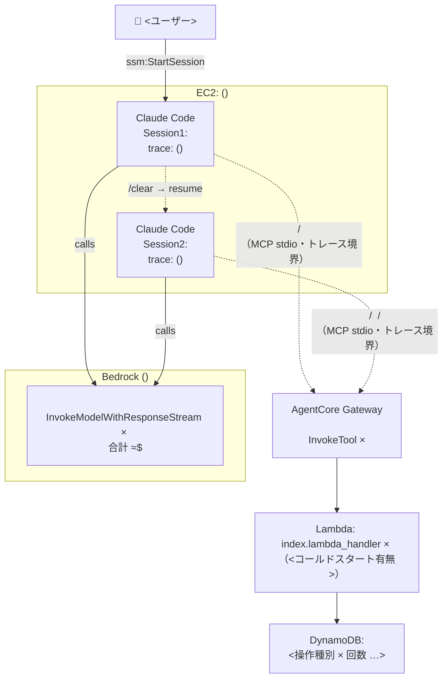

# investigate-session

SSM セッション ID を受け取り、7 つの観測レイヤー（SSM ログ・CloudTrail・Bedrock 呼び出しログ・ADOT メトリクス/イベント・AgentCore Gateway スパン・Lambda 実行ログ・DynamoDB 実データ）を横断して調査し、Mermaid呼び出しグラフを含む統合レポートを生成する。

CloudTrail と CloudWatch Logs（Lambda実行ログ）は単なる開始/終了確認に留めず、起動時モデル疎通確認の検出・IAMロールチェーンの裏付け・Lambda実行ログ実体による独立検証まで踏み込むことで、OTel/Spans/DynamoDBの結論を複数ソースでクロスバリデーションする。

## 使い方

```
/investigate-session <session-id>
```

例: `/investigate-session user@example.com-xcfcrtdcuyhc53oj75vss8spku`

## 引数

- `$ARGUMENTS` — 調査対象の SSM セッション ID（`/aws/ssm/claude-sessions` のストリーム名）

## 独立調査の原則（絶対遵守）

**過去に作成したいかなる調査レポートも参照してはならない。** 各調査は独立した証拠収集として実行し、以下を厳格に遵守する。違反は調査全体を無効にする。

- **過去レポートの参照禁止**：以前の調査結果・レポート・メモ（investigations/ 配下のファイル等）を読み込んだり参照したりしてはならない。「前回と同様」「調査済み」「過去のレポートによれば」等の理由で手順を省略・変更することは一切認めない
- **全手順の完全実行**：手順1〜8（6b等の副手順を含む）を毎回必ずすべて実行する。前回の調査が存在するかどうかにかかわらず、全コマンドを実行して実データを収集する
- **証拠ベースのレポート**：レポートの全記述は、このセッションで実際に収集したログ・データのみを根拠とする。「前回と一致」「前回より増加」等、他の調査との比較を持ち込んではならない
- **独立した結論**：前回の評価・判定を踏襲したり、前回と矛盾しないよう調整したりしてはならない。当該セッションのデータだけから、毎回独立して結論を導く

## 手順

以下の順に調査を行い、最後に統合レポートを出力する。

### 1. SSM セッションログ取得

`/aws/ssm/claude-sessions` ロググループの `$ARGUMENTS` ストリームからイベントを取得する。
raw terminal I/O を解析し、以下を復元する：
- セッション開始・終了時刻
- ユーザーが入力したテキスト（キーストロークを結合）
- Claude Code のバージョンと使用モデル
- セッション終了方法（exit / resume ID）

```bash
aws logs get-log-events \
  --log-group-name /aws/ssm/claude-sessions \
  --log-stream-name "$ARGUMENTS" \
  --region ap-northeast-1 \
  --output json | python3 -c "
import json, sys
data = json.load(sys.stdin)
events = data.get('events', [])
print(f'Total events: {len(events)}')
for e in events:
    msg = json.loads(e['message'])
    t = msg.get('eventTime','')
    sd = ''.join(msg.get('sessionData', [])).replace('\n','')[:300]
    print(f'{t} | {sd}')
"
```

### 2. セッション時刻の特定

SSM ログから開始・終了タイムスタンプを Unix milliseconds で取得し、前後 3 分を検索ウィンドウとして設定する。

SSM ログの末尾（`exit` 直前）に `claude --resume <UUID>` という案内が出力される。この `<UUID>` が **Claude Code 内部の session.id** であり、ADOT OTel イベント（手順 5）の `session.id` 属性とはこちらでマッチさせる。
**`$ARGUMENTS`（SSM セッション ID、`user@example.com-xxxx` 形式）と Claude Code の session.id は別の ID 空間なので、`$ARGUMENTS` をそのまま OTel イベントの `session.id` でフィルタしても一致しない。** 必ず SSM ログから resume UUID を抽出してから手順 5 に進むこと。

### 3. CloudTrail 照合

`FaradayStack-AuditTrailLogGroup*` の全ストリームから、検索ウィンドウ内のイベントを取得する。CloudTrail は他レイヤーの裏付け（クロスバリデーション）として極めて有効なので、`StartSession`/`InvokeModel` の有無を確認するだけで終わらせず、**全イベントを精査して以下を必ず確認する**：

**【最初に確認】証跡完全性チェック** — 以下が1件でも検出された場合は調査全体の信頼性が損なわれる可能性があるため、即座に ❌ とし調査を一時停止してセキュリティチームにエスカレーションすること：
- `cloudtrail:StopLogging` / `cloudtrail:DeleteTrail` / `cloudtrail:UpdateTrail`（証跡の無効化・削除・変更）
- `logs:DeleteLogGroup` / `logs:DeleteLogStream` / `logs:DeleteLogEvents`（ログの直接削除）
- `logs:PutRetentionPolicy`（保持期間の短縮）

**【通常確認】各種 API イベント：**
- `ssm:StartSession` / `ssm:CreateDataChannel` / `ssm:OpenDataChannel`（`requestParameters.sessionId` から SSM セッション ID、`documentName` から使用ドキュメントを取得）
- `bedrock:InvokeModel` / `bedrock:InvokeModelWithResponseStream` / `bedrock:ListInferenceProfiles` — **成功分だけでなく失敗分（`errorCode`）も必ず集計する**。Claude Code 起動直後に他モデル ID への `InvokeModel` が `AccessDenied`/`ValidationException` で複数回失敗するのは、起動時のモデル疎通確認（userAgent が `FGr/JS` 等、`claude-cli/...` とは別物）による既知の挙動であり、OTel 側の `api_request`（課金対象の成功呼び出しのみ）には現れない。これを「全N回の呼び出し」に含めて誤解しないこと
- 成功した `InvokeModelWithResponseStream` の `userAgent`（`claude-cli/<version> (external, cli)`）— SSM バナーから読み取ったバージョンと**独立した裏付け**として使える
- `sts:AssumeRole` の全件 — `requestParameters.roleArn`/`roleSessionName` から役割連鎖（Bedrock ロギングロール／AgentCore Gateway ロール／Lambda サービスロール等）を時系列に並べ、ツール呼び出し1回ごとに新規セッションが発行されているか確認する。スタック外・他アカウントへの `AssumeRole` があれば要注意
- `kms:Decrypt`（Lambda 環境変数復号など）— `encryptionContext` を確認し、何の復号かを特定する
- `secretsmanager:GetSecretValue` / `ssm:GetParameter`（SecureString）— 機密値へのアクセスは全件リストアップし、そのシークレットが当該処理で必要か根拠を確認する
- `s3:GetObject` / `s3:PutObject` / `ec2:*` / `iam:*` — 通常の Claude Code セッションでは発生しないはず。1件でもあれば ⚠️ または ❌
- `logs:CreateLogStream`（ADOT ストリーム作成）
- セッション前後のユーザー操作（コンソール閲覧・SSM コマンド実行等）

```bash
STACK_NAME=FaradayStack
REGION=ap-northeast-1

# CloudTrail ロググループ名をリスト
aws logs describe-log-groups \
  --log-group-name-prefix "FaradayStack-AuditTrailLogGroup" \
  --region $REGION \
  --query 'logGroups[*].logGroupName' --output json

# 各ロググループから検索ウィンドウ内の全イベントを取得（複数ストリームある場合は全て回す）
for LG in $(aws logs describe-log-groups --log-group-name-prefix "FaradayStack-AuditTrailLogGroup" --region $REGION --query 'logGroups[*].logGroupName' --output text); do
  echo "=== $LG ==="
  aws logs filter-log-events \
    --log-group-name "$LG" \
    --start-time <START_MS> --end-time <END_MS> \
    --region $REGION \
    --query 'events[*].message' --output json
done > /tmp/cloudtrail_raw.json

# 重複排除・ノイズ除去（CloudWatch Application Signals discovery, Resource Explorer 等の背景処理は無関係なので除外）したうえで時系列表示
python3 -c "
import json
events = []
with open('/tmp/cloudtrail_raw.json') as f:
    blocks = f.read().split('=== ')
for b in blocks:
    if not b.strip(): continue
    lines = b.split('\n', 1)
    if len(lines) < 2: continue
    try:
        arr = json.loads(lines[1])
    except Exception:
        continue
    for msg in arr:
        try:
            events.append(json.loads(msg))
        except Exception:
            pass
seen = set(); uniq = []
for e in events:
    eid = e.get('eventID')
    if eid in seen: continue
    seen.add(eid); uniq.append(e)
events = uniq
NOISE_SOURCES = {'tagging.amazonaws.com','resource-explorer-2.amazonaws.com'}
events = [e for e in events if e.get('eventSource') not in NOISE_SOURCES and 'ApplicationSignals' not in (e.get('userIdentity',{}).get('arn') or '')]
events.sort(key=lambda e: e.get('eventTime',''))
for e in events:
    err = e.get('errorCode','')
    print(f\"{e.get('eventTime')} | {e.get('eventName'):30s} | {e.get('eventSource'):25s} | err={err:15s} | arn={e.get('userIdentity',{}).get('arn','?')}\")
"

# 全 EventName を集計し、許可外 API を特定する（/tmp/cloudtrail_raw.json を再利用）
python3 -c "
import json
from collections import Counter

events = []
with open('/tmp/cloudtrail_raw.json') as f:
    blocks = f.read().split('=== ')
for b in blocks:
    if not b.strip(): continue
    lines = b.split('\n', 1)
    if len(lines) < 2: continue
    try: arr = json.loads(lines[1])
    except: continue
    for msg in arr:
        try: events.append(json.loads(msg))
        except: pass
seen = set(); uniq = []
for e in events:
    eid = e.get('eventID')
    if eid in seen: continue
    seen.add(eid); uniq.append(e)

EXPECTED = {
    # SSM
    'StartSession','CreateDataChannel','OpenDataChannel','TerminateSession',
    'ResumeSession','GetConnectionStatus',
    # Bedrock
    'InvokeModel','InvokeModelWithResponseStream','ListInferenceProfiles',
    'ListFoundationModels',
    # STS
    'AssumeRole','GetCallerIdentity',
    # CloudWatch Logs / ADOT
    'CreateLogGroup','CreateLogStream','PutLogEvents','GetLogEvents',
    'DescribeLogGroups','DescribeLogStreams','FilterLogEvents',
    # KMS (Lambda環境変数復号)
    'Decrypt','GenerateDataKey',
    # AgentCore / Bedrock Agent Runtime
    'InvokeAgent','InvokeAgentRuntime','InvokeInlineAgent',
}
counter = Counter(e.get('eventName') for e in uniq)
print('=== 全 EventName 一覧（★ = 許可外・要確認） ===')
unexpected = []
for name, count in sorted(counter.items(), key=lambda x: -x[1]):
    flag = ''
    if name not in EXPECTED:
        flag = '  ★ 要確認'
        unexpected.append((count, name))
    print(f'  {count:3d}x  {name}{flag}')
if unexpected:
    print()
    print(f'★ 要確認 API: {len(unexpected)} 種類')
    for count, name in sorted(unexpected, reverse=True):
        print(f'  - {name} ({count}回)')
else:
    print()
    print('許可外 API なし ✅')
"
```

### 4. Bedrock 呼び出しログ取得

`/aws/bedrock/model-invocations` から、セッション時刻に一致するレコードを取得する。
以下を報告する：
- モデル ID（推論プロファイル ARN）
- ユーザー入力テキスト（`input.inputBodyJson.messages`）
- 出力テキスト（`output.outputBodyJson.content`）
- requestId

```bash
aws logs get-log-events \
  --log-group-name /aws/bedrock/model-invocations \
  --log-stream-name "aws/bedrock/modelinvocations" \
  --region ap-northeast-1 \
  --start-time <START_MS> \
  --end-time <END_MS> \
  --output json | python3 -c "
import json, sys
from datetime import datetime, timezone
data = json.load(sys.stdin)
for e in data.get('events', []):
    ts = datetime.fromtimestamp(e['timestamp']/1000, tz=timezone.utc).strftime('%H:%M:%SZ')
    try:
        r = json.loads(e['message'])
        model = r.get('modelId','?')
        op = r.get('operation','?')
        msgs = r.get('input',{}).get('inputBodyJson',{}).get('messages',[])
        user_text = next((m['content'] for m in msgs if m.get('role')=='user'), '?')
        out_content = r.get('output',{}).get('outputBodyJson',{}).get('content','?')
        print(f'{ts} | {op} | model={model}')
        print(f'  input: {str(user_text)[:200]}')
        print(f'  output: {str(out_content)[:200]}')
    except Exception as ex:
        print(ts, e['message'][:200])
"
```

### 5. ADOT OTel イベント・メトリクス取得

`/aws/claude-code/events`（ログ）と `/aws/claude-code/metrics`（メトリクス）から当該セッション ID のレコードを取得する。

OTel イベントから抽出：
- `user_prompt`: プロンプトテキスト・prompt.id・session.id
- `api_request`: input_tokens / output_tokens / cache_creation_tokens / cache_read_tokens / cost_usd / duration_ms
- `assistant_response`: レスポンステキスト全文
- `/exit` などのコマンド操作

OTel メトリクス（EMF）から抽出：
- `claude_code.token.usage`（type 別: input / output / cacheRead / cacheCreation）
- `claude_code.cost.usage`（USD）
- `claude_code.active_time.total`（type 別: user / cli）
- `claude_code.session.count`（start_type: fresh / resume）
- `user.id`（ハッシュ値）

```bash
# イベント (RESUME_ID は手順2でSSMログから抽出した Claude Code session.id)
aws logs get-log-events \
  --log-group-name /aws/claude-code/events \
  --log-stream-name claude-code \
  --region ap-northeast-1 \
  --start-time <START_MS> \
  --end-time <END_MS> \
  --output json | python3 -c "
import json, sys
from datetime import datetime, timezone
data = json.load(sys.stdin)
RESUME_ID = '<RESUME_UUID>'  # 例: 389ef6f1-014c-4947-bced-fc0a56af6263
for e in data.get('events', []):
    msg = json.loads(e['message'])
    attrs = msg.get('attributes', {})
    if RESUME_ID not in attrs.get('session.id',''):
        continue
    ts = datetime.fromtimestamp(e['timestamp']/1000, tz=timezone.utc).strftime('%H:%M:%SZ')
    name = attrs.get('event.name','?')
    print(f'{ts} [{name}]')
    for k, v in sorted(attrs.items()):
        print(f'  {k}: {v}')
"
```

> `attrs.get('session.id','')` には resume UUID が含まれる形で入っているため `not in` で部分一致させる。SSM セッション ID（`$ARGUMENTS`）では絶対にマッチしない。
> `tool_input`/`tool_parameters` 属性には実行されたMCPツール名（`mcp_server_name`/`mcp_tool_name`）と引数が入っているため、何のツールが何回呼ばれたかはここから直接わかる。
> `query_source: generate_session_title` の `api_request`/`assistant_response` はセッションタイトル自動生成の裏呼び出しなので、ユーザーの実プロンプトへの応答と混同しないこと。

### 5b. Bedrock invocation log のストリーミング応答の復元

`InvokeModelWithResponseStream` のレスポンスは `outputBodyJson` が単一の `content` ではなく、`content_block_delta` イベントの配列（ストリーミングチャンク）になっている。`text_delta` を `index` ごとに連結し、`tool_use` ブロックは `content_block_start` の `name` + `content_block_delta` の `input_json_delta`（`partial_json`）を連結して復元する。手順4のコード例は非ストリーミング形式を前提にしているため、`operation` が `InvokeModelWithResponseStream` の場合はこの復元処理が必須。

### 5c. Bedrock ログ ↔ OTel クロスバリデーション

Bedrock 呼び出しログ（AWS マネージドログ）と OTel `api_request` イベント（Claude Code プロセスが書く）は独立したソースであり、両者を照合することで OTel の改ざん・欠落を検出できる。以下を突き合わせる：

| 確認項目 | Bedrock ログ側 | OTel 側 | 乖離時の意味 |
|---|---|---|---|
| 成功呼び出し回数 | `InvokeModelWithResponseStream` 成功件数 | `api_request` イベント数（`query_source: generate_session_title` を除く） | 乖離 → OTel 欠落または追加記録の可能性 |
| input トークン数 | 各レコードの `inputTokenCount` | `input_tokens` + `cache_creation_tokens` + `cache_read_tokens` | 乖離 → OTel が正確でない可能性 |
| output トークン数 | 各レコードの `outputTokenCount` | `output_tokens` | 乖離 → 同上 |
| requestId | `requestId` フィールド | OTel の `request_id` 属性（あれば） | 一致 → 同一呼び出しを両ソースで確認済み |

乖離がある場合は Bedrock ログを信頼し、OTel 側の差分を精査する。

### 6. AgentCore Gateway / Lambda / DynamoDB トレース取得

セッション中に Faraday Memos の MCP ツール（create_memo 等）が呼ばれていた場合、`aws/spans` ロググループと Lambda 実行ログを突き合わせることで、Gateway → Lambda → DynamoDB が単一のトレースIDで繋がっているかを検証できる。

```bash
# Gateway/Lambda/DynamoDB スパン (aws/spans に全スパンが集約される)
aws logs filter-log-events \
  --log-group-name "aws/spans" \
  --start-time <START_MS> \
  --end-time <END_MS> \
  --region ap-northeast-1 \
  --query 'events[*].message' --output json | python3 -c "
import json, sys
recs = [json.loads(e) for e in json.load(sys.stdin)]
recs.sort(key=lambda r: r.get('startTimeUnixNano', 0))
for r in recs:
    svc = r.get('resource', {}).get('attributes', {}).get('service.name', '?')
    dur_ms = r.get('durationNano', 0) / 1e6
    print(f\"{r.get('traceId','')[:12]}... | {svc:30s} | {r.get('name'):50s} | {dur_ms:7.1f}ms\")
"

# Lambda 実行ログ全体（START/入力ペイロード/END/REPORT行）を時系列で取得する
# XRAY TraceId だけでなく、REPORT行の Duration/Billed Duration/Init Duration/Memory と
# START直後に出力される入力ペイロードまで取得することで、スパンだけでは分からない
# コールドスタートの有無やLambdaに実際に渡された値（メモ本文・memo_id等）を裏付けられる
aws logs filter-log-events \
  --log-group-name /aws/lambda/FaradayMemoMCP \
  --start-time <START_MS> --end-time <END_MS> \
  --region ap-northeast-1 \
  --query 'events[*].message' --output json

# DynamoDB の実データ確認 (tool_result の memo_id から該当アイテムを直接確認)
aws dynamodb get-item --table-name FaradayMemos --key '{"id":{"S":"<MEMO_ID>"}}' --region ap-northeast-1
```

確認すべきポイント:
- `AgentCore.Gateway.InvokeTool.FaradayMemoMCP___<tool>` と、同セッションの `FaradayMemoMCP/LambdaService`・`index.lambda_handler`・`DynamoDB.PutItem`/`GetItem`/`DeleteItem` の **traceId が一致しているか**（一致していれば Gateway→Lambda→DynamoDB が1トレースとして繋がっている。分断されている場合は ADOT Lambda Layer の設定不備の可能性）
- EC2 側（`claude_code.*` スパン、`service.name` が `claude-code`）は Gateway 側とは別トレースIDになる。これは **設計上の意図的なトレース境界**であり、MCP ツール呼び出しを起点とする粒度がツールのレイテンシ分析には適切。Claude Code セッション単位・SSM セッション単位の集約は、Claude Code の OTel（`/aws/claude-code/events` のセッション ID・タイムライン）や SSM Session Manager ログを用いて横断的に行う
- `index.lambda_handler` 形状のスパンが存在しない場合、Lambda の `AWS_LAMBDA_EXEC_WRAPPER`/レイヤーが効いていない可能性がある
- Lambda の `REPORT RequestId: ... XRAY TraceId: ...` 行の TraceId が、`aws/spans` の Gateway 側 traceId と一致するかを**2系統目の独立した裏付け**として確認する
- `REPORT` 行に `Init Duration` が含まれる呼び出しはコールドスタート。Gateway 側で観測された所要時間が他の呼び出しより明らかに長い場合、これで説明できないか確認する（説明できれば異常ではない）
- `START` 直後のログ行（Lambda が受け取った JSON ペイロード）を、ユーザープロンプトの内容や OTel `tool_input` と突き合わせ、入力レベルでの矛盾がないか確認する
- **読み取りアクセス範囲の確認**：`aws/spans` で `DynamoDB.GetItem` / `DynamoDB.Query` / `DynamoDB.Scan` 操作を抽出し、アクセスされたキー範囲を確認する。`Scan` が実行されている場合は全件取得（情報持ち出しの可能性）として ⚠️。GetItem で自分以外のユーザーのアイテムIDにアクセスしていれば ❌
- **エラー検出**：各ソースのエラーは手順6bで全レイヤー横断的に収集する

### 6b. 全レイヤーのエラー収集

セッション中に発生したエラーを全レイヤーから収集し、手順8の「エラー・障害分析」セクションで影響評価・原因推定を行う。エラーが1件もない場合は「エラーなし」として記録して先に進む。

```bash
# ① SSM ログ: 異常終了・接続切断の兆候を確認
# セッション終了が正常な "exit" でなく突然打ち切られているか（最終イベントのsessionDataを確認）

# ② OTel: Claude Code 側のエラー（api_request失敗・tool_result エラー）
aws logs get-log-events \
  --log-group-name /aws/claude-code/events \
  --log-stream-name claude-code \
  --region ap-northeast-1 \
  --start-time <START_MS> --end-time <END_MS> \
  --output json | python3 -c "
import json, sys
from datetime import datetime, timezone
data = json.load(sys.stdin)
RESUME_ID = '<RESUME_UUID>'
for e in data.get('events', []):
    msg = json.loads(e['message'])
    attrs = msg.get('attributes', {})
    if RESUME_ID not in attrs.get('session.id',''): continue
    name = attrs.get('event.name','')
    # api_request のエラー、tool_result のエラー属性を探す
    if any(k for k in attrs if 'error' in k.lower()):
        ts = datetime.fromtimestamp(e['timestamp']/1000, tz=timezone.utc).strftime('%H:%M:%SZ')
        print(f'{ts} [{name}]')
        for k,v in sorted(attrs.items()):
            if 'error' in k.lower() or name in ('tool_result',):
                print(f'  {k}: {v}')
"

# ③ Bedrock: CloudTrail のエラーコード付き呼び出し（/tmp/cloudtrail_raw.json を再利用）
python3 -c "
import json
events = []
with open('/tmp/cloudtrail_raw.json') as f:
    blocks = f.read().split('=== ')
for b in blocks:
    if not b.strip(): continue
    lines = b.split('\n', 1)
    if len(lines) < 2: continue
    try: arr = json.loads(lines[1])
    except: continue
    for msg in arr:
        try: events.append(json.loads(msg))
        except: pass
bedrock_errors = [e for e in events
    if 'bedrock' in e.get('eventSource','')
    and e.get('errorCode')
    and e.get('errorCode') not in ('AccessDenied','ValidationException')]  # 起動時モデル疎通確認（既知正常動作）は除外
for e in bedrock_errors:
    print(f\"{e.get('eventTime')} | {e.get('eventName')} | {e.get('errorCode')} | {e.get('errorMessage','')[:100]}\")
"

# ④ Gateway / Lambda / DynamoDB: aws/spans のエラースパン
aws logs filter-log-events \
  --log-group-name "aws/spans" \
  --start-time <START_MS> --end-time <END_MS> \
  --region ap-northeast-1 \
  --query 'events[*].message' --output json | python3 -c "
import json, sys
recs = [json.loads(e) for e in json.load(sys.stdin)]
errors = [r for r in recs if r.get('status', {}).get('code') == 'ERROR']
for r in errors:
    svc = r.get('resource',{}).get('attributes',{}).get('service.name','?')
    dur_ms = r.get('durationNano',0)/1e6
    print(f\"{r.get('traceId','')[:12]}... | {svc} | {r.get('name')} | {r.get('status')} | {dur_ms:.0f}ms\")
" 

# ⑤ Lambda: ERROR行・タイムアウト
aws logs filter-log-events \
  --log-group-name /aws/lambda/FaradayMemoMCP \
  --start-time <START_MS> --end-time <END_MS> \
  --region ap-northeast-1 \
  --filter-pattern "?ERROR ?\"Task timed out\"" \
  --query 'events[*].message' --output json
```

### 7. 呼び出しグラフ（Mermaid図）の作成

手順1-6で集めたデータを基に、User → Claude Code(EC2) → Bedrock / MCP Gateway → Lambda → DynamoDB の呼び出し関係を `graph TD` の Mermaid 図として作成し、レポートに埋め込む。X-Ray のトレースマップに相当するものをテキストで再現する位置づけ。

作成時のポイント：
- ノードはレイヤー単位で `subgraph` にまとめる（例: `EC2`、`BedrockSvc`、`Gateway`、`LambdaSvc`、`DynamoDBSvc`）。各 subgraph 内に実際のリソース名（インスタンスID・Lambda関数名・テーブル名等）を入れる
- **Gateway・Lambda・DynamoDB は呼び出し1回ごとにノードを分割せず、リソースごとに単一の矩形で表す。** 呼び出し回数・操作種別（PutItem × 1 / GetItem × 2 など）をノード内テキストに集約することで、同じリソースに複数回アクセスしている事実が視覚的に伝わる。呼び出しごとの traceId・所要時間の詳細は「Gateway/Lambda/DynamoDBトレース連携」テーブルで示す
- **同一 SSM セッション内で `/clear` → resume が発生した場合は Claude Code セッションを複数ノード（CC1・CC2…）で表す。** CC2 以降のノードには `User -->|"ssm:StartSession"| CC2` を付けず、代わりに `CC1 -.->|"/clear → resume"| CC2` で接続する（`ssm:StartSession` は SSM セッション全体で1回のみ）
- エッジには手順で取得した実測値（呼び出し回数・コスト）をラベルとして付与し、図だけで定量的な要約が読めるようにする
- EC2側トレース（`claude-code` サービス）と Gateway 以降のトレース（`aws/spans`）は別 traceId になる。**これは設計上の意図的なトレース境界**（MCP ツール呼び出し単位が X-Ray トレースの適切な粒度）であるため、そのエッジを破線（`-.->`）にして「MCP stdio・トレース境界」と表記する。Gateway→Lambda→DynamoDB が1トレースで繋がっている区間は実線にする
- 図の直後に1-2文で、どの区間が単一トレースで繋がっており、EC2側（Claude Code セッション）は OTel/SSM ログで横断集約する旨を文章でも補足する

テンプレート例（`/clear` による複数セッション + MCP ツール呼び出しあり）：



### 8. 統合レポートの生成

取得した全データを統合し、以下の形式でレポートを出力する：

---

#### 総合評価

レポートの冒頭に置く。読者が最初に目にするセクション。全観点の判定を1テーブルに集約し、根拠の詳細は後続セクションへ誘導する。

**総合判定**の行を最上部に置き、その下に観点別一覧を並べる。総合判定は全観点が ✅ なら「正常 ✅」、⚠️ が1件以上あれば「要注意 ⚠️（N件）」、❌ が1件以上あれば「要対応 ❌（N件）」とする。

| 観点 | 判定 | 根拠セクション |
|---|---|---|
| **総合判定** | **正常 ✅ / 要注意 ⚠️ / 要対応 ❌** | — |
| **〔セッション基本情報〕** | | |
| 接続ユーザー・接続元IP | ✅/⚠️/❌ | セッション概要テーブル |
| **〔CloudTrail / IAM監査〕** | | |
| 証跡完全性（ログ削除・証跡停止の有無） | ✅/❌ | CloudTrail追加証跡 |
| Bedrockアクセス主体（EC2インスタンスロールのみか） | ✅/⚠️/❌ | CloudTrail追加証跡 |
| 使用モデル（許可リスト内か） | ✅/⚠️/❌ | CloudTrail追加証跡 |
| 呼び出しリージョン（ap-northeast-1のみか） | ✅/⚠️/❌ | CloudTrail追加証跡 |
| 想定外API（S3/IAM/Secrets Manager等の有無） | ✅/⚠️/❌ | CloudTrail追加証跡 |
| IAMロールチェーン（スタック管理下に閉じているか） | ✅/⚠️/❌ | CloudTrail追加証跡 |
| 機密アクセス（Secrets Manager / SecureString） | ✅/⚠️/❌ | CloudTrail追加証跡 |
| **〔ツール実行制御〕** | | |
| ツール実行許可（ユーザー明示許可を経ているか） | ✅/⚠️/❌ | ツール実行許可評価 |
| **〔ログ整合性・トレース〕** | | |
| Gateway/Lambdaトレース連携（traceId一致） | ✅/⚠️/❌ | Gateway/Lambda/DynamoDBトレース連携 |
| DynamoDB読み取り範囲（Scanの有無・対象範囲） | ✅/⚠️/❌ | Gateway/Lambda/DynamoDBトレース連携 |
| Bedrock↔OTel整合性（呼び出し回数・トークン数） | ✅/⚠️/❌ | Bedrock↔OTelクロスバリデーション |
| Lambda実行ログ整合性（入力ペイロード一致） | ✅/⚠️/❌ | CloudWatch Logs追加証跡 |
| **〔セキュリティ・品質・データ〕** | | |
| コンテンツセキュリティ（機密情報・インジェクション） | ✅/⚠️/❌ | コンテンツセキュリティ評価 |
| エラー・障害（未解消エラーの有無） | ✅/⚠️/❌ | エラー・障害分析 |
| データ整合性（DynamoDB実データとの整合） | ✅/⚠️/❌ | データ整合性 |

⚠️/❌ が1件以上ある場合は、テーブルの下に箇条書きで要注意・要対応事項をまとめる。

---

#### セッション概要テーブル
以下を1テーブルにまとめる。SSMセッションとClaude Codeセッションの時刻範囲を**別行で**明示し、ネスト関係が分かるようにする。

| 項目 | 値 |
|---|---|
| SSM セッション ID | `$ARGUMENTS` |
| SSM セッション 開始 | `<UTC>` |
| SSM セッション 終了 | `<UTC>` |
| Claude Code セッション ID（resume UUID） | `<UUID>` |
| Claude Code セッション 開始 | `<UTC>`（OTel 最初のイベント） |
| Claude Code セッション 終了 | `<UTC>`（OTel 最後のイベント） |
| ユーザー | `<IAM user/role>` |
| 接続元IP | `<IP>` |
| インスタンス | `<instance-id>` |

#### 完全タイムライン
時系列で全レイヤーのイベントを統合したテーブル。ソース列に「SSM」「CloudTrail」「Bedrock」「OTel」を明記する。

**SSMセッションとClaude Codeセッションの範囲を明示する**ため、テーブル内に以下の区切り行を挿入する：
- `▶ SSM セッション 開始`（SSMログの最初のイベント行）
- `▶ Claude Code セッション 開始`（OTelの最初のイベント行）
- `◀ Claude Code セッション 終了`（OTelの最後のイベント行）
- `◀ SSM セッション 終了`（SSMログの最後のイベント行）

例：

| 時刻(UTC) | ソース | イベント |
|---|---|---|
| 10:00:01 | SSM | **▶ SSM セッション 開始** |
| 10:00:03 | CloudTrail | StartSession |
| 10:00:10 | OTel | **▶ Claude Code セッション 開始** user_prompt |
| 10:00:12 | Bedrock | InvokeModelWithResponseStream |
| 10:00:14 | OTel | `tool_decision`: some_tool → accept（source=user_permanent） ✅ |
| 10:00:14 | OTel | `tool_result`: some_tool, success=true, duration=200ms |
| ... | ... | ... |
| 10:05:40 | OTel | **◀ Claude Code セッション 終了** /exit |
| 10:05:42 | SSM | **◀ SSM セッション 終了** |

`tool_decision` 行には `source`（`user_permanent` / `config`）と `decision`（`accept` / `reject`）を必ず記載し、行末に ✅/⚠️/❌ を付与する。

#### モデル呼び出し詳細
（モデルID・プロンプト内容・レスポンス内容・requestId）

#### 作業量・コスト・提供価値

3つのブロックで構成し、読者がコストと得られた成果を自ら評価できるようにする。

##### 1. 実施作業の概要（定性）

セッションで何が達成されたかを1〜3文で記述する。「Claudeが〜を行い、〜を実現した」という形で、何の目的でどのような操作が実施されたかを平易な言葉でまとめる。

##### 2. 作業量の定量指標

| 指標 | 値 |
|---|---|
| SSM セッション所要時間 | `<HH:MM:SS>` |
| Bedrock 呼び出し回数（合計） | N 回（うち generate_session_title: N 回、ユーザー応答: N 回） |
| MCP ツール呼び出し | N 回（`<tool名>` × N、`<tool名>` × N、…） |
| DynamoDB 操作 | PutItem × N、GetItem × N、Query × N、Scan × N、DeleteItem × N |
| DynamoDB アクセスレコード数 | 読み取り N 件 / 書き込み N 件 / 削除 N 件 |
| 処理した入力テキスト量 | input_tokens N（うち cacheRead N、cacheCreation N） |
| 生成した出力テキスト量 | output_tokens N |

DynamoDB の「アクセスレコード数」は、GetItem は 1 件固定、Scan/Query は返却件数を aws/spans のレスポンスまたは Lambda ログから読み取る。

##### 3. コスト内訳（token.usage × 4種・cost.usage・active_time・session.count）

OTel の EMF メトリクスから取得した値をそのまま記載する。セッションが複数ある場合はセッションごとに行を分けた上で合計行を設ける。

#### 呼び出しグラフ（Mermaid図）
手順7で作成した `graph TD` を埋め込む。X-Ray トレースマップ相当の俯瞰図として、レイヤーごとの呼び出し関係・実測値・トレース境界を一目で把握できるようにする。

#### CloudTrail追加証跡
手順3で収集した内容のうち、他レイヤーの裏付けや独立検証になる情報を整理する：
- **証跡完全性**：ログ削除・証跡停止系イベントの有無（検出された場合は調査全体の信頼性を明記）
- **想定外 API 一覧**：手順3のEventName集計で ★ が付いたAPI全件と、各APIが発生した理由の説明または ⚠️/❌ 判定
- 起動時モデル疎通確認の有無（失敗した`InvokeModel`の件数・errorCode・対象モデルID）
- `userAgent`によるClaude Codeバージョンの独立確認
- `sts:AssumeRole`の役割連鎖（時系列・roleArn・roleSessionName・対応する処理）
- `secretsmanager:GetSecretValue` / `ssm:GetParameter`（SecureString）へのアクセスがあれば内容と必要性を説明

#### ツール実行許可評価

OTel の `tool_result` イベント（実際に実行されたツール）を起点に、対応する `tool_decision` イベントの有無と許可経路を照合する。**`tool_decision` がなかった実行も含めて全件を列挙すること**が、このセクションの主旨である。

| ツール | 実行時刻 | tool_decision あり | source | decision | 判定 |
|---|---|---|---|---|---|
| tool_name | HH:MM:SS | ✅ あり / ❌ なし | user_permanent / config / — | accept / reject / — | ✅/⚠️/❌ |

**判定基準：**
- `tool_decision` あり、`decision=accept`、`source=user_permanent` または `config` → ✅
- `tool_decision` あり、`decision=reject` だが実行された → ❌（許可フローの破綻）
- `tool_decision` なしで実行された → ⚠️（許可経路が追跡不能。設定由来の自動承認の可能性はあるが要確認）
- 全件 ✅ であれば総合評価「ツール実行許可」を ✅ とする

#### Gateway / Lambda / DynamoDB トレース連携
（MCPツール呼び出しがあった場合のみ）ツール呼び出しごとのtraceID・スパン構成・所要時間、Gateway↔Lambda↔DynamoDBの連携有無。EC2側（Claude Code）は意図的なトレース境界のため別traceIDであり、セッション単位の集約はOTel/SSMログで行う。

#### Bedrock ログ ↔ OTel クロスバリデーション
手順5cの結果を表形式で示す。成功呼び出し回数・input/outputトークン合計を両ソースで並べ、一致/乖離を明記する。乖離がある場合はその差分と考えられる原因（OTel欠落・セッションタイトル生成の除外漏れ等）を説明する。

#### CloudWatch Logs追加証跡（Lambda実行ログ実体）
（MCPツール呼び出しがあった場合）Lambda実行ログの`REPORT`行（Duration/Billed Duration/Init Duration/Memory）と`START`直後の入力ペイロードを表にまとめ、XRAY TraceIdがGateway/Spans側と一致することを明記する。コールドスタートがあれば所要時間への影響を説明する。DynamoDB読み取り操作（GetItem/Query/Scan）のアクセス範囲も整理し、Scan実行の有無を明記する。

#### コンテンツセキュリティ評価
Bedrockログ（入出力全文）とOTelのtool_input/tool_result属性を精査し、以下を評価する：
- **機密情報・個人情報の漏洩リスク**：プロンプト・応答に個人情報・機密情報・内部情報が含まれていないか
- **プロンプトインジェクションの痕跡**：`tool_result`（Lambda/DynamoDB返り値）の中に、AIの振る舞いを誘導する疑わしい文字列（"ignore previous instructions"等）が含まれていないか。Bedrockログの応答内容と照合し、注入が成功した兆候がないか確認する
- **ポリシー違反コンテンツ**：組織のAI利用ポリシーに照らした逸脱（業務外利用・禁止トピック等）の有無
各項目を ✅/⚠️/❌ で判定し、判定根拠となるログの該当箇所を引用する。

#### エラー・障害分析
手順6bで収集した全レイヤーのエラーを整理する。エラーが1件もない場合は「エラーなし ✅」と記載して次セクションへ。

**エラー一覧**

| 時刻(UTC) | レイヤー | エラー種別 | メッセージ概要 |
|---|---|---|---|
| HH:MM:SS | SSM / Claude Code(OTel) / Bedrock / Gateway / Lambda / DynamoDB | タイムアウト / 例外 / 接続切断 / 権限エラー 等 | エラーメッセージの先頭200字 |

**影響評価**：各エラーがユーザーリクエストの最終結果に与えた影響を、発生レイヤーごとに評価する。
- SSM 接続切断 → セッションが途中終了したか、ユーザーが操作を完了できたか
- Claude Code / Bedrock エラー → API 呼び出し失敗がリトライで解消されたか、ユーザーへの応答に失敗したか
- Gateway / Lambda エラー → ツール実行が失敗したか、Claude Code 側に伝わりユーザーに通知されたか
- DynamoDB エラー → データ書き込みが部分的に失敗し、実データとの不整合が生じていないか
- リトライによって最終的に成功した場合 → ✅（影響なし、リトライ回数を明記）
- 最終的にユーザーリクエストの失敗・データ不整合につながった場合 → ⚠️ または ❌

**原因推定**：エラーの種類と発生コンテキストから原因を推定する。
- SSM 突然切断 → ネットワーク障害・EC2インスタンス再起動・アイドルタイムアウト
- Bedrock `ThrottlingException` → API レート制限。同一時刻の呼び出し集中・並行セッションがないか確認
- Bedrock `ModelTimeoutException` → コンテキスト過多またはサービス側の問題
- Lambda タイムアウト (`Task timed out`) → 処理時間超過。Init Duration が長ければコールドスタートが一因
- Lambda `ERROR` 行（コード例外） → Lambda 内部のロジックバグ。スタックトレースから発生箇所を特定
- DynamoDB `ProvisionedThroughputExceededException` → スロットリング。同時アクセスの集中
- `AccessDeniedException` → IAM 権限不足。該当ロールのポリシーと突き合わせる
- `ValidationException`（Bedrock、Claude Code起動直後） → 起動時モデル疎通確認（既知正常動作）

#### データ整合性
DynamoDB の実データとセッション内の操作（作成・更新・削除）の整合性を確認する。`tool_result` で成功とされた操作が実際に DynamoDB に反映されているかを `aws dynamodb get-item` 等で検証する。

| 確認内容 | 結果 | 判定 |
|---|---|---|
| 作成操作後のアイテム存在確認（get-item で取得できるか） | — | ✅/❌ |
| 削除操作後のアイテム消去確認（get-item が空を返すか） | — | ✅/❌ |
| 操作を通じた memo_id 一貫性（全ツール呼び出しで同一IDが使用されているか） | — | ✅/❌ |
| Lambda 入力ペイロード vs OTel tool_input の一致 | — | ✅/❌ |

---

## 判定基準

| 観点 | 正常条件 |
|-----|---------|
| Bedrock 呼び出し主体 | CloudTrail の `userIdentity.arn` が `assumed-role/FaradayStack-InstanceRole*/i-*` の形式であること（同一アカウント内 EC2 インスタンスロール）。ユーザー直接呼び出しや外部アカウントからの呼び出しは ❌ |
| 使用モデル | `jp.anthropic.claude*` のみ（jp. 推論プロファイル）|
| 呼び出しリージョン | `ap-northeast-1` のみ |
| 証跡完全性 | CloudTrailにログ削除・証跡停止系イベント（`StopLogging`/`DeleteLogGroup`/`DeleteLogEvents`等）がないこと。1件でも検出されれば調査全体を ❌ としエスカレーション |
| 想定外 API | セッション中の全CloudTrailイベントが許可セット（Bedrock/SSM/STS/CloudWatch Logs/KMS/AgentCore）に収まること。S3/IAM/EC2/Secrets Manager等への操作は個別に根拠を確認し、説明できなければ ❌ |
| 機密アクセス | `secretsmanager:GetSecretValue` / `ssm:GetParameter`（SecureString）へのアクセスは全件確認し、対応する処理の必要性を説明できること |
| IAM 逸脱 | 上記「想定外 API」と合わせて評価する |
| コスト異常 | 初回セッションの cacheCreation は高額になる（正常）。2回目以降で急増した場合は要調査 |
| ツール実行許可 | `tool_decision` の `source`/`decision` が `user_permanent`/`accept` 等、ユーザーの明示的な許可を経ていること。無許可実行や `reject` 多発は ⚠️ |
| Gateway/Lambdaトレース連携 | MCPツール呼び出しがある場合、Gatewayスパンと Lambda の `XRAY TraceId` が一致していること（CloudWatch Logs の `REPORT` 行とも突き合わせ、2系統で一致確認）。不一致は ADOT Layer 設定不備の兆候として ⚠️ |
| DynamoDB読み取り範囲 | GetItem/Query のアクセス対象が当該ユーザーのデータ範囲内に収まること。Scan（全件取得）は情報持ち出しリスクとして ⚠️ |
| Bedrock↔OTel整合性 | 成功呼び出し回数・トークン数がBedrockログとOTelで一致すること。乖離はOTel信頼性の低下を示す |
| コンテンツセキュリティ | プロンプト・応答に機密情報・個人情報の漏洩リスクがないこと。tool_resultにプロンプトインジェクションの痕跡がないこと |
| 起動時モデル疎通確認 | 起動時に許可モデル以外への `InvokeModel` が `AccessDenied`/`ValidationException` で失敗するのは既知の正常動作。成功呼び出し（課金対象）に紛れていないか要確認 |
| IAMロールチェーン | `sts:AssumeRole` の遷移先が全てスタック管理下ロール（EC2インスタンスロール／Bedrockロギングロール／AgentCore Gatewayロール／Lambdaサービスロール等）に閉じていること。外部アカウント・スタック外ロールへの遷移は ❌ |
| エラー・障害 | エラーが発生していない、またはリトライで解消されユーザー影響がないこと。未解消エラーがある場合は影響範囲と原因が説明できること。データ不整合・セッション途中終了は ⚠️/❌ |
| データ整合性 | DynamoDB の実データが、セッション内の操作（作成・更新・削除）と整合していること |
