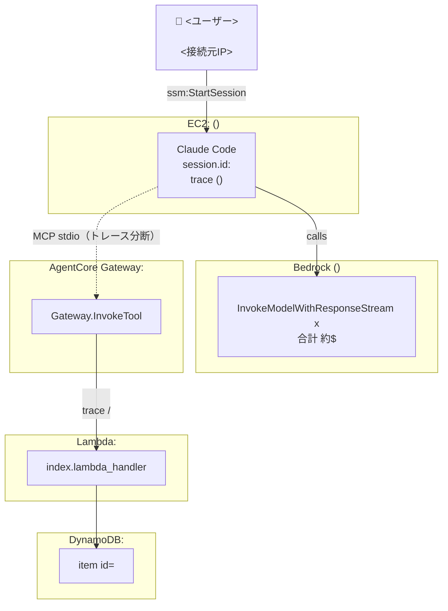

# investigate-session

SSM セッション ID を受け取り、7 つの観測レイヤー（SSM ログ・CloudTrail・Bedrock 呼び出しログ・ADOT メトリクス/イベント・AgentCore Gateway スパン・Lambda 実行ログ・DynamoDB 実データ）を横断して調査し、Mermaid呼び出しグラフを含む統合レポートを生成する。

CloudTrail と CloudWatch Logs（Lambda実行ログ）は単なる開始/終了確認に留めず、モデルプロービングの検出・IAMロールチェーンの裏付け・Lambda実行ログ実体による独立検証まで踏み込むことで、OTel/Spans/DynamoDBの結論を複数ソースでクロスバリデーションする。

## 使い方

```
/investigate-session <session-id>
```

例: `/investigate-session user@example.com-xcfcrtdcuyhc53oj75vss8spku`

## 引数

- `$ARGUMENTS` — 調査対象の SSM セッション ID（`/aws/ssm/claude-sessions` のストリーム名）

## 手順

以下の順に調査を行い、最後に統合レポートを出力する。

### 1. SSM セッションログ取得

`/aws/ssm/claude-sessions` ロググループの `$ARGUMENTS` ストリームからイベントを取得する。
raw terminal I/O を解析し、以下を復元する：
- セッション開始・終了時刻
- ユーザーが入力したテキスト（キーストロークを結合）
- Claude Code のバージョンと使用モデル
- セッション終了方法（exit / resume ID）

```bash
aws logs get-log-events \
  --log-group-name /aws/ssm/claude-sessions \
  --log-stream-name "$ARGUMENTS" \
  --region ap-northeast-1 \
  --output json | python3 -c "
import json, sys
data = json.load(sys.stdin)
events = data.get('events', [])
print(f'Total events: {len(events)}')
for e in events:
    msg = json.loads(e['message'])
    t = msg.get('eventTime','')
    sd = ''.join(msg.get('sessionData', [])).replace('\n','')[:300]
    print(f'{t} | {sd}')
"
```

### 2. セッション時刻の特定

SSM ログから開始・終了タイムスタンプを Unix milliseconds で取得し、前後 3 分を検索ウィンドウとして設定する。

SSM ログの末尾（`exit` 直前）に `claude --resume <UUID>` という案内が出力される。この `<UUID>` が **Claude Code 内部の session.id** であり、ADOT OTel イベント（手順 5）の `session.id` 属性とはこちらでマッチさせる。
**`$ARGUMENTS`（SSM セッション ID、`user@example.com-xxxx` 形式）と Claude Code の session.id は別の ID 空間なので、`$ARGUMENTS` をそのまま OTel イベントの `session.id` でフィルタしても一致しない。** 必ず SSM ログから resume UUID を抽出してから手順 5 に進むこと。

### 3. CloudTrail 照合

`FaradayStack-AuditTrailLogGroup*` の全ストリームから、検索ウィンドウ内のイベントを取得する。CloudTrail は他レイヤーの裏付け（クロスバリデーション）として極めて有効なので、`StartSession`/`InvokeModel` の有無を確認するだけで終わらせず、**全イベントを精査して以下を必ず確認する**：

- `ssm:StartSession` / `ssm:CreateDataChannel` / `ssm:OpenDataChannel`（`requestParameters.sessionId` から SSM セッション ID、`documentName` から使用ドキュメントを取得）
- `bedrock:InvokeModel` / `bedrock:InvokeModelWithResponseStream` / `bedrock:ListInferenceProfiles` — **成功分だけでなく失敗分（`errorCode`）も必ず集計する**。Claude Code 起動直後に他モデル ID への `InvokeModel` が `AccessDenied`/`ValidationException` で複数回失敗するのは、起動時のモデル疎通プロービング（userAgent が `FGr/JS` 等、`claude-cli/...` とは別物）による既知の挙動であり、OTel 側の `api_request`（課金対象の成功呼び出しのみ）には現れない。これを「全N回の呼び出し」に含めて誤解しないこと
- 成功した `InvokeModelWithResponseStream` の `userAgent`（`claude-cli/<version> (external, cli)`）— SSM バナーから読み取ったバージョンと**独立した裏付け**として使える
- `sts:AssumeRole` の全件 — `requestParameters.roleArn`/`roleSessionName` から役割連鎖（Bedrock ロギングロール／AgentCore Gateway ロール／Lambda サービスロール等）を時系列に並べ、ツール呼び出し1回ごとに新規セッションが発行されているか確認する。スタック外・他アカウントへの `AssumeRole` があれば要注意
- `kms:Decrypt`（Lambda 環境変数復号など）— `encryptionContext` を確認し、何の復号かを特定する
- `logs:CreateLogStream`（ADOT ストリーム作成）
- セッション前後のユーザー操作（コンソール閲覧・SSM コマンド実行等）

```bash
STACK_NAME=FaradayStack
REGION=ap-northeast-1

# CloudTrail ロググループ名をリスト
aws logs describe-log-groups \
  --log-group-name-prefix "FaradayStack-AuditTrailLogGroup" \
  --region $REGION \
  --query 'logGroups[*].logGroupName' --output json

# 各ロググループから検索ウィンドウ内の全イベントを取得（複数ストリームある場合は全て回す）
for LG in $(aws logs describe-log-groups --log-group-name-prefix "FaradayStack-AuditTrailLogGroup" --region $REGION --query 'logGroups[*].logGroupName' --output text); do
  echo "=== $LG ==="
  aws logs filter-log-events \
    --log-group-name "$LG" \
    --start-time <START_MS> --end-time <END_MS> \
    --region $REGION \
    --query 'events[*].message' --output json
done > /tmp/cloudtrail_raw.json

# 重複排除・ノイズ除去（CloudWatch Application Signals discovery, Resource Explorer 等の背景処理は無関係なので除外）したうえで時系列表示
python3 -c "
import json
events = []
with open('/tmp/cloudtrail_raw.json') as f:
    blocks = f.read().split('=== ')
for b in blocks:
    if not b.strip(): continue
    lines = b.split('\n', 1)
    if len(lines) < 2: continue
    try:
        arr = json.loads(lines[1])
    except Exception:
        continue
    for msg in arr:
        try:
            events.append(json.loads(msg))
        except Exception:
            pass
seen = set(); uniq = []
for e in events:
    eid = e.get('eventID')
    if eid in seen: continue
    seen.add(eid); uniq.append(e)
events = uniq
NOISE_SOURCES = {'tagging.amazonaws.com','resource-explorer-2.amazonaws.com'}
events = [e for e in events if e.get('eventSource') not in NOISE_SOURCES and 'ApplicationSignals' not in (e.get('userIdentity',{}).get('arn') or '')]
events.sort(key=lambda e: e.get('eventTime',''))
for e in events:
    err = e.get('errorCode','')
    print(f\"{e.get('eventTime')} | {e.get('eventName'):30s} | {e.get('eventSource'):25s} | err={err:15s} | arn={e.get('userIdentity',{}).get('arn','?')}\")
"
```

### 4. Bedrock 呼び出しログ取得

`/aws/bedrock/model-invocations` から、セッション時刻に一致するレコードを取得する。
以下を報告する：
- モデル ID（推論プロファイル ARN）
- ユーザー入力テキスト（`input.inputBodyJson.messages`）
- 出力テキスト（`output.outputBodyJson.content`）
- requestId

```bash
aws logs get-log-events \
  --log-group-name /aws/bedrock/model-invocations \
  --log-stream-name "aws/bedrock/modelinvocations" \
  --region ap-northeast-1 \
  --start-time <START_MS> \
  --end-time <END_MS> \
  --output json | python3 -c "
import json, sys
from datetime import datetime, timezone
data = json.load(sys.stdin)
for e in data.get('events', []):
    ts = datetime.fromtimestamp(e['timestamp']/1000, tz=timezone.utc).strftime('%H:%M:%SZ')
    try:
        r = json.loads(e['message'])
        model = r.get('modelId','?')
        op = r.get('operation','?')
        msgs = r.get('input',{}).get('inputBodyJson',{}).get('messages',[])
        user_text = next((m['content'] for m in msgs if m.get('role')=='user'), '?')
        out_content = r.get('output',{}).get('outputBodyJson',{}).get('content','?')
        print(f'{ts} | {op} | model={model}')
        print(f'  input: {str(user_text)[:200]}')
        print(f'  output: {str(out_content)[:200]}')
    except Exception as ex:
        print(ts, e['message'][:200])
"
```

### 5. ADOT OTel イベント・メトリクス取得

`/aws/claude-code/events`（ログ）と `/aws/claude-code/metrics`（メトリクス）から当該セッション ID のレコードを取得する。

OTel イベントから抽出：
- `user_prompt`: プロンプトテキスト・prompt.id・session.id
- `api_request`: input_tokens / output_tokens / cache_creation_tokens / cache_read_tokens / cost_usd / duration_ms
- `assistant_response`: レスポンステキスト全文
- `/exit` などのコマンド操作

OTel メトリクス（EMF）から抽出：
- `claude_code.token.usage`（type 別: input / output / cacheRead / cacheCreation）
- `claude_code.cost.usage`（USD）
- `claude_code.active_time.total`（type 別: user / cli）
- `claude_code.session.count`（start_type: fresh / resume）
- `user.id`（ハッシュ値）

```bash
# イベント (RESUME_ID は手順2でSSMログから抽出した Claude Code session.id)
aws logs get-log-events \
  --log-group-name /aws/claude-code/events \
  --log-stream-name claude-code \
  --region ap-northeast-1 \
  --start-time <START_MS> \
  --end-time <END_MS> \
  --output json | python3 -c "
import json, sys
from datetime import datetime, timezone
data = json.load(sys.stdin)
RESUME_ID = '<RESUME_UUID>'  # 例: 389ef6f1-014c-4947-bced-fc0a56af6263
for e in data.get('events', []):
    msg = json.loads(e['message'])
    attrs = msg.get('attributes', {})
    if RESUME_ID not in attrs.get('session.id',''):
        continue
    ts = datetime.fromtimestamp(e['timestamp']/1000, tz=timezone.utc).strftime('%H:%M:%SZ')
    name = attrs.get('event.name','?')
    print(f'{ts} [{name}]')
    for k, v in sorted(attrs.items()):
        print(f'  {k}: {v}')
"
```

> `attrs.get('session.id','')` には resume UUID が含まれる形で入っているため `not in` で部分一致させる。SSM セッション ID（`$ARGUMENTS`）では絶対にマッチしない。
> `tool_input`/`tool_parameters` 属性には実行されたMCPツール名（`mcp_server_name`/`mcp_tool_name`）と引数が入っているため、何のツールが何回呼ばれたかはここから直接わかる。
> `query_source: generate_session_title` の `api_request`/`assistant_response` はセッションタイトル自動生成の裏呼び出しなので、ユーザーの実プロンプトへの応答と混同しないこと。

### 5b. Bedrock invocation log のストリーミング応答の復元

`InvokeModelWithResponseStream` のレスポンスは `outputBodyJson` が単一の `content` ではなく、`content_block_delta` イベントの配列（ストリーミングチャンク）になっている。`text_delta` を `index` ごとに連結し、`tool_use` ブロックは `content_block_start` の `name` + `content_block_delta` の `input_json_delta`（`partial_json`）を連結して復元する。手順4のコード例は非ストリーミング形式を前提にしているため、`operation` が `InvokeModelWithResponseStream` の場合はこの復元処理が必須。

### 6. AgentCore Gateway / Lambda / DynamoDB トレース取得

セッション中に Faraday Memos の MCP ツール（create_memo 等）が呼ばれていた場合、`aws/spans` ロググループと Lambda 実行ログを突き合わせることで、Gateway → Lambda → DynamoDB が単一のトレースIDで繋がっているかを検証できる。

```bash
# Gateway/Lambda/DynamoDB スパン (aws/spans に全スパンが集約される)
aws logs filter-log-events \
  --log-group-name "aws/spans" \
  --start-time <START_MS> \
  --end-time <END_MS> \
  --region ap-northeast-1 \
  --query 'events[*].message' --output json | python3 -c "
import json, sys
recs = [json.loads(e) for e in json.load(sys.stdin)]
recs.sort(key=lambda r: r.get('startTimeUnixNano', 0))
for r in recs:
    svc = r.get('resource', {}).get('attributes', {}).get('service.name', '?')
    dur_ms = r.get('durationNano', 0) / 1e6
    print(f\"{r.get('traceId','')[:12]}... | {svc:30s} | {r.get('name'):50s} | {dur_ms:7.1f}ms\")
"

# Lambda 実行ログ全体（START/入力ペイロード/END/REPORT行）を時系列で取得する
# XRAY TraceId だけでなく、REPORT行の Duration/Billed Duration/Init Duration/Memory と
# START直後に出力される入力ペイロードまで取得することで、スパンだけでは分からない
# コールドスタートの有無やLambdaに実際に渡された値（メモ本文・memo_id等）を裏付けられる
aws logs filter-log-events \
  --log-group-name /aws/lambda/FaradayMemoMCP \
  --start-time <START_MS> --end-time <END_MS> \
  --region ap-northeast-1 \
  --query 'events[*].message' --output json

# DynamoDB の実データ確認 (tool_result の memo_id から該当アイテムを直接確認)
aws dynamodb get-item --table-name FaradayMemos --key '{"id":{"S":"<MEMO_ID>"}}' --region ap-northeast-1
```

確認すべきポイント:
- `AgentCore.Gateway.InvokeTool.FaradayMemoMCP___<tool>` と、同セッションの `FaradayMemoMCP/LambdaService`・`index.lambda_handler`・`DynamoDB.PutItem`/`GetItem`/`DeleteItem` の **traceId が一致しているか**（一致していれば Gateway→Lambda→DynamoDB が1トレースとして繋がっている。分断されている場合は ADOT Lambda Layer の設定不備の可能性）
- EC2 側（`claude_code.*` スパン、`service.name` が `claude-code`）は通常 Gateway 側とは別トレースIDになる（`mcp-proxy-for-aws` がOTel非対応のため、現状の既知の制約）
- `index.lambda_handler` 形状のスパンが存在しない場合、Lambda の `AWS_LAMBDA_EXEC_WRAPPER`/レイヤーが効いていない可能性がある
- Lambda の `REPORT RequestId: ... XRAY TraceId: ...` 行の TraceId が、`aws/spans` の Gateway 側 traceId と一致するかを**2系統目の独立した裏付け**として確認する
- `REPORT` 行に `Init Duration` が含まれる呼び出しはコールドスタート。Gateway 側で観測された所要時間が他の呼び出しより明らかに長い場合、これで説明できないか確認する（説明できれば異常ではない）
- `START` 直後のログ行（Lambda が受け取った JSON ペイロード）を、ユーザープロンプトの内容や OTel `tool_input` と突き合わせ、入力レベルでの矛盾がないか確認する

### 7. 呼び出しグラフ（Mermaid図）の作成

手順1-6で集めたデータを基に、User → Claude Code(EC2) → Bedrock / MCP Gateway → Lambda → DynamoDB の呼び出し関係を `graph TD` の Mermaid 図として作成し、レポートに埋め込む。X-Ray のトレースマップに相当するものをテキストで再現する位置づけ。

作成時のポイント：
- ノードはレイヤー単位で `subgraph` にまとめる（例: `EC2`、`BedrockSvc`、`Gateway`、`LambdaSvc`、`DynamoDBSvc`）。各 subgraph 内に実際のリソース名（インスタンスID・Lambda関数名・テーブル名等）を入れる
- エッジには手順で取得した実測値（呼び出し回数・traceId・所要時間・コスト）をラベルとして付与し、図だけで定量的な要約が読めるようにする
- EC2側トレース（`claude-code` サービス）と Gateway 以降のトレード（`aws/spans`）が別 traceId に分断される場合は、そのエッジを破線（`-.->`）にして「トレース分断（既知の制約）」である旨を明記する。実トレースが繋がっている区間（Gateway→Lambda→DynamoDB）は実線にする
- 図の直後に1-2文で、どの区間が単一トレースで繋がっており、どこが分断されているか（理由つき）を文章でも補足する

テンプレート例：



### 8. 統合レポートの生成

取得した全データを統合し、以下の形式でレポートを出力する：

---

#### セッション概要テーブル
（開始/終了時刻・ユーザー・接続元IP・インスタンス・Claudeセッション ID）

#### 完全タイムライン
時系列で全レイヤーのイベントを統合したテーブル。
ソース列に「SSM」「CloudTrail」「Bedrock」「OTel」を明記する。

#### モデル呼び出し詳細
（モデルID・プロンプト内容・レスポンス内容・requestId）

#### コスト・トークン分析
（token.usage × 4種・cost.usage・active_time・session.count）

#### 呼び出しグラフ（Mermaid図）
手順7で作成した `graph TD` を埋め込む。X-Ray トレースマップ相当の俯瞰図として、レイヤーごとの呼び出し関係・実測値・トレース分断箇所を一目で把握できるようにする。

#### Gateway / Lambda / DynamoDB トレース連携
（MCPツール呼び出しがあった場合のみ）ツール呼び出しごとのtraceID・スパン構成・所要時間、Gateway↔Lambda↔DynamoDBの連携有無、EC2側トレースとの分断有無。

#### CloudTrail追加証跡
手順3で収集した内容のうち、他レイヤーの裏付けや独立検証になる情報を整理する：
- モデル探索/プロービングの有無（失敗した`InvokeModel`の件数・errorCode・対象モデルID）
- `userAgent`によるClaude Codeバージョンの独立確認
- `sts:AssumeRole`の役割連鎖（時系列・roleArn・roleSessionName・対応する処理）
- `kms:Decrypt`等、見慣れないAPIコールがあれば内容の特定

#### CloudWatch Logs追加証跡（Lambda実行ログ実体）
（MCPツール呼び出しがあった場合）Lambda実行ログの`REPORT`行（Duration/Billed Duration/Init Duration/Memory）と`START`直後の入力ペイロードを表にまとめ、XRAY TraceIdがGateway/Spans側と一致することを明記する。コールドスタートがあれば所要時間への影響を説明する。

#### アカウント・クラウド状態の適切性評価
各観点（接続ユーザー・Bedrockアクセス主体・使用モデル・呼び出しリージョン・IAMロール逸脱・異常コール・ツール実行許可・Gateway/Lambdaトレース連携・Lambda実行ログ整合性・データ整合性）について ✅/⚠️/❌ で判定し根拠を示す。CloudTrail/CloudWatch Logs由来の根拠を他レイヤー（OTel/Spans/DynamoDB）と組み合わせ、複数ソースでクロスバリデーションされていることが分かるように書く。

---

## 判定基準

| 観点 | 正常条件 |
|-----|---------|
| Bedrock 呼び出し主体 | CloudTrail の `userIdentity.arn` が `assumed-role/FaradayStack-InstanceRole*/i-*` の形式であること（同一アカウント内 EC2 インスタンスロール）。ユーザー直接呼び出しや外部アカウントからの呼び出しは ❌ |
| 使用モデル | `jp.anthropic.claude*` のみ（jp. 推論プロファイル）|
| 呼び出しリージョン | `ap-northeast-1` のみ |
| IAM 逸脱 | Bedrock / SSM / CloudWatch 以外への過剰な API コールがないこと |
| コスト異常 | 初回セッションの cacheCreation は高額になる（正常）。2回目以降で急増した場合は要調査 |
| ツール実行許可 | `tool_decision` の `source`/`decision` が `user_permanent`/`accept` 等、ユーザーの明示的な許可を経ていること。無許可実行や `reject` 多発は ⚠️ |
| Gateway/Lambdaトレース連携 | MCPツール呼び出しがある場合、Gatewayスパンと Lambda の `XRAY TraceId` が一致していること（CloudWatch Logs の `REPORT` 行とも突き合わせ、2系統で一致確認）。不一致は ADOT Layer 設定不備の兆候として ⚠️ |
| モデルプロービング | 起動時に許可モデル以外への `InvokeModel` が `AccessDenied`/`ValidationException` で失敗するのは既知の正常動作。成功呼び出し（課金対象）に紛れていないか要確認 |
| IAMロールチェーン | `sts:AssumeRole` の遷移先が全てスタック管理下ロール（EC2インスタンスロール／Bedrockロギングロール／AgentCore Gatewayロール／Lambdaサービスロール等）に閉じていること。外部アカウント・スタック外ロールへの遷移は ❌ |
| データ整合性 | DynamoDB の実データが、セッション内の操作（作成・更新・削除）と整合していること |
