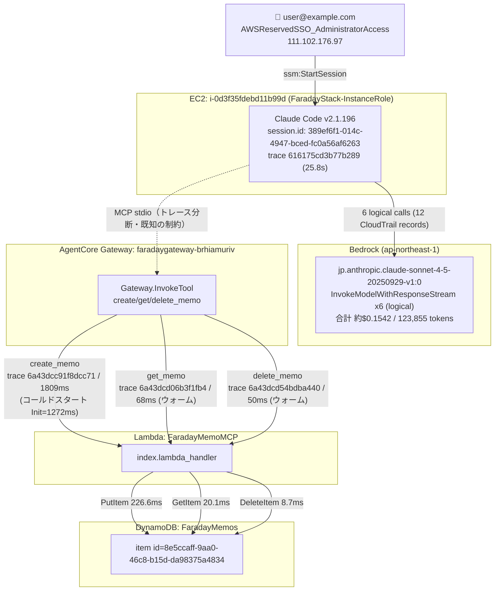

# セッション調査レポート: obs-verify-20260630-004 メモ検証セッション

> **調査対象 SSM セッション ID**: `user@example.com-kh4obvrhgzvlxy8ijrxka9viie`
> **調査日**: 2026-07-01
> **注記**: 本レポートは update 後の `investigate-session` スキルで新規に作成したものであり、`investigations/2026-06-30_memo-verify-session.md`（update 前のスキルによる既存調査結果）の内容は一切参照していない。

---

## セッション概要

| 項目 | 値 |
|---|---|
| SSM セッション ID | `user@example.com-kh4obvrhgzvlxy8ijrxka9viie` |
| Claude Code session.id（resume UUID） | `389ef6f1-014c-4947-bced-fc0a56af6263` |
| 開始時刻 | 2026-06-30T15:11:44Z（CloudTrail `StartSession`）/ 15:11:46Z（ターミナル表示開始） |
| 終了時刻 | 2026-06-30T15:12:30Z（`exit`） |
| 接続ユーザー | `user@example.com`（IAM Identity Center: `AWSReservedSSO_AdministratorAccess_9445badae67c7bfe`） |
| 接続元 IP | `111.102.176.97` |
| 接続クライアント | `aws-cli/2.32.3`（WSL2 / Debian 13） |
| 対象 EC2 インスタンス | `i-0d3f35fdebd11b99d`（t3.medium, ap-northeast-1a, Private IP `10.0.0.25`） |
| IAM インスタンスプロファイル | `FaradayStack-InstanceV17InstanceProfile6D46AAA7-0xL4GYEUQRyx` |
| SSM ドキュメント | `FaradayStack-ClaudeSessionDocument-5YfSwyzLMCdv` |
| Claude Code バージョン | v2.1.196（SSM バナー表示、CloudTrail `userAgent` の両方で確認） |
| 使用モデル | `jp.anthropic.claude-sonnet-4-5-20250929-v1:0`（推論プロファイル） |
| セッション終了方法 | `/exit`（resume案内: `claude --resume 389ef6f1-014c-4947-bced-fc0a56af6263`） |
| ユーザープロンプト | 「obs-verify-20260630-004というタイトルでメモを作成し、作成できたらすぐにそのIDで取得して内容を確認し、最後に削除してください。各ステップの結果を逐一報告して」 |

---

## 完全タイムライン

| 時刻(UTC) | ソース | イベント |
|---|---|---|
| 15:11:42 | CloudTrail | `DescribeInstances`（user@example.com, SSO Admin） |
| 15:11:44 | CloudTrail | `OpenDataChannel` / `StartSession`（ssm, sessionId=`user@example.com-kh4obvrhgzvlxy8ijrxka9viie`, doc=`FaradayStack-ClaudeSessionDocument-5YfSwyzLMCdv`） |
| 15:11:44 | CloudTrail | `CreateDataChannel`（InstanceRole `i-0d3f35fdebd11b99d`） |
| 15:11:45 | CloudTrail | `InvokeModel` x2 `AccessDenied`、`ListInferenceProfiles` `AccessDenied`、`InvokeModel` x8 `ValidationException`（userAgent=`FGr/JS 0.94.0` — 起動時モデルプロービング、既知の正常動作） |
| 15:11:46 | SSM | Claude Code v2.1.196 起動バナー表示 |
| 15:11:46 | CloudTrail | `CreateLogStream` / `DescribeLogStreams`（ADOT ログストリーム初期化、InstanceRole） |
| 15:11:47 | OTel | `mcp_server_connection`（faraday-memos, stdio, connected, 1846ms） |
| 15:11:58 | SSM | ユーザーがプロンプト入力 |
| 15:11:58 | OTel | `user_prompt`（prompt.id=`0ed6a758-02a2-42b0-aa2a-470b603d8cf4`） |
| 15:11:58 | Bedrock | `InvokeModelWithResponseStream`（セッションタイトル生成, reqId=`89167327-23e2-4297-a202-10b4fa57bf43`） |
| 15:11:59 | CloudTrail | `InvokeModelWithResponseStream` 成功（userAgent=`claude-cli/2.1.196 (external, cli)`） |
| 15:11:59 | OTel | `api_request`（query_source=generate_session_title, cost=$0.001677, in=424/out=27） |
| 15:11:59 | OTel | `assistant_response`（タイトル: "メモの作成・取得・削除テスト"） |
| 15:11:58 | Bedrock | `InvokeModelWithResponseStream`（メインターン, reqId=`843fb45a-7568-4eab-b538-5ccda57ef34f`） |
| 15:12:03 | OTel | `tool_decision`（ToolSearch, accept, source=config） |
| 15:12:03 | OTel | `tool_result`（ToolSearch, success, 3ms） |
| 15:12:03 | OTel | `api_request`（cost=$0.09562, cacheCreation=23807, out=421, thinking=240） |
| 15:12:03 | OTel | `assistant_response`（「メモの作成、取得、削除の操作を行います...」） |
| 15:12:03 | Bedrock | `InvokeModelWithResponseStream`（create_memo 呼び出し決定, reqId=`91b7d7b3-5057-4593-902e-6ede752bff77`） |
| 15:12:07 | OTel | `api_request`（cost=$0.01207, cacheCreation=523, cacheRead=23807, out=196） |
| 15:12:07 | OTel | `assistant_response`（「それでは、メモを作成します。」） |
| 15:12:09 | OTel | `tool_decision`（create_memo, **accept, source=user_permanent**） |
| 15:12:09 | CloudTrail | `AssumeRole` → `FaradayStack-BedrockLoggingRole`（BedrockModelInvocationLogSession） |
| 15:12:10 | CloudTrail | `AssumeRole` → `FaradayStack-MemoLambdaServiceRole`（tracing）, `FaradayStack-AgentCoreGatewayRole`（gateway-session-c4d493d3-...） |
| 15:12:10 | CloudTrail | `kms:Decrypt`（MemoLambdaServiceRole, encryptionContext=Lambda関数ARN — Lambda環境変数復号） |
| 15:12:10 | CloudTrail | `CreateLogStream`（MemoLambdaServiceRole — Lambdaログストリーム初期化） |
| 15:12:10 | Spans | `AgentCore.Gateway.InvokeTool.FaradayMemoMCP___create_memo`（traceId `6a43dcc91f8dcc71`, 1809ms）→ `FaradayMemoMCP/LambdaService` → `Init/LambdaExecutionEnvironment`（**1272.1ms コールドスタート**）→ `index.lambda_handler`（227.4ms）→ `DynamoDB.PutItem`（226.6ms） |
| 15:12:10 | Lambda Logs | `START RequestId=92868dc0-...` payload=`{"title":"obs-verify-20260630-004","content":"This is a test memo for verification purposes."}` → `REPORT Duration=231.34ms Billed=1504ms Init=1272.11ms Memory=256MB Max=121MB` `XRAY TraceId=1-6a43dcc9-1f8dcc714eac012b053a7b98` |
| 15:12:11 | OTel | `tool_result`（create_memo, success, 1972ms） |
| 15:12:11 | Bedrock | アシスタント応答: 「ステップ1完了: メモの作成に成功。ID: `8e5ccaff-9aa0-46c8-b15d-da98375a4834`」 |
| 15:12:12 | CloudTrail | `InvokeModelWithResponseStream` 成功 |
| 15:12:15 | OTel | `api_request`（cost=$0.022083, cacheCreation=3335, cacheRead=21014, out=217） |
| 15:12:15 | OTel | `assistant_response`（ステップ1完了報告） |
| 15:12:16 | OTel | `tool_decision`（get_memo, **accept, source=user_permanent**） |
| 15:12:16 | CloudTrail | `AssumeRole` → `AgentCoreGatewayRole`（gateway-session-b5c49c2f-...）, `MemoLambdaServiceRole`（tracing） |
| 15:12:16 | Spans | `AgentCore.Gateway.InvokeTool.FaradayMemoMCP___get_memo`（traceId `6a43dcd06b3f1fb4`, 68ms）→ `index.lambda_handler`（20.7ms）→ `DynamoDB.GetItem`（20.1ms）— **ウォームスタート（Initスパンなし）** |
| 15:12:16 | Lambda Logs | `START RequestId=a4cb6d1d-...` payload=`{"memo_id":"8e5ccaff-9aa0-46c8-b15d-da98375a4834"}` → `REPORT Duration=39.16ms Billed=40ms`（Init行なし=ウォーム）`XRAY TraceId=1-6a43dcd0-6b3f1fb471b8f3fe23f6d4ff` |
| 15:12:16 | OTel | `tool_result`（get_memo, success, 232ms） |
| 15:12:17 | CloudTrail | `InvokeModelWithResponseStream` 成功 |
| 15:12:20 | OTel | `api_request`（cost=$0.012625, cacheCreation=334, cacheRead=24349, out=270） |
| 15:12:20 | OTel | `assistant_response`（ステップ2完了報告、メモ内容確認） |
| 15:12:21 | OTel | `tool_decision`（delete_memo, **accept, source=user_permanent**） |
| 15:12:21 | CloudTrail | `AssumeRole` → `AgentCoreGatewayRole`（gateway-session-9539a9af-...）, `MemoLambdaServiceRole`（tracing） |
| 15:12:21 | Spans | `AgentCore.Gateway.InvokeTool.FaradayMemoMCP___delete_memo`（traceId `6a43dcd54bdba440`, 50ms）→ `index.lambda_handler`（9.1ms）→ `DynamoDB.DeleteItem`（8.7ms）— ウォームスタート |
| 15:12:21 | Lambda Logs | `START RequestId=2c562e43-...` payload=`{"memo_id":"8e5ccaff-9aa0-46c8-b15d-da98375a4834"}` → `REPORT Duration=11.80ms Billed=12ms` `XRAY TraceId=1-6a43dcd5-4bdba4400ad647a54c4e3ce1` |
| 15:12:21 | OTel | `tool_result`（delete_memo, success, 190ms） |
| 15:12:22 | CloudTrail | `InvokeModelWithResponseStream` 成功 |
| 15:12:23 | OTel | `api_request`（cost=$0.010074, cacheCreation=311, cacheRead=24683, out=99） |
| 15:12:23 | OTel | `assistant_response`（「ステップ3完了: メモの削除に成功。全ステップ完了。」） |
| 15:12:23 | CloudTrail | `InvokeModelWithResponseStream` 成功 |
| 15:12:29 | OTel | `user_prompt`（`/exit`コマンド） |
| 15:12:29 | CloudTrail | `AssumeRole` → `FaradayStack-BedrockLoggingRole` |
| 15:12:30 | SSM | セッション終了、resume案内表示 |
| 15:12:35〜 | CloudTrail | セッション後の user@example.com によるコンソール閲覧（Resource Explorer / X-Ray Insights）— セッション自体とは無関係 |

---

## モデル呼び出し詳細

| reqId | 時刻 | 種別 | 内容 |
|---|---|---|---|
| `89167327-...` | 15:11:58Z | タイトル生成 | 入力: ユーザープロンプト全文 → 出力: `{"title": "メモの作成・取得・削除テスト"}` |
| `843fb45a-...` | 15:11:58Z | メインターン | ToolSearchツール呼び出し（create/get/delete_memo のスキーマ取得） |
| `91b7d7b3-...` | 15:12:03Z | メインターン | `create_memo({"title":"obs-verify-20260630-004","content":"This is a test memo for verification purposes."})` |
| `aabe2dbb-...` | 15:12:11Z | メインターン | ステップ1報告 + `get_memo({"memo_id":"8e5ccaff-9aa0-46c8-b15d-da98375a4834"})` |
| `329c132e-...` | 15:12:16Z | メインターン | ステップ2報告（内容確認）+ `delete_memo({"memo_id":"8e5ccaff-9aa0-46c8-b15d-da98375a4834"})` |
| `27610463-...` | 15:12:21Z | メインターン | ステップ3完了報告・全体総括 |

全モデルID: `arn:aws:bedrock:ap-northeast-1:346929044083:inference-profile/jp.anthropic.claude-sonnet-4-5-20250929-v1:0`（`jp.` 推論プロファイルのみ、一貫）

---

## コスト・トークン分析

### トークン使用量（`claude_code.token.usage`、type別合計）

| type | 合計 |
|---|---|
| input | 462 |
| output | 1,230 |
| cacheCreation | 28,310 |
| cacheRead | 93,853 |

### コスト（`api_request` イベント基準の合算）

| 呼び出し | cost_usd |
|---|---|
| タイトル生成 | $0.001677 |
| ToolSearch | $0.095621 |
| create_memo決定 | $0.012073 |
| get_memo決定 | $0.022083 |
| delete_memo決定 | $0.012625 |
| 最終報告 | $0.010074 |
| **合計** | **≈ $0.1542** |

### アクティブ時間 / セッション種別

- `claude_code.active_time.total`: `cli`=17.049s, `user`=1.319s
- `claude_code.session.count`: `start_type=fresh`, count=1（resume ではなく新規セッション）
- `user.id`（ハッシュ）: `a038528a5501e938caff8b1208ce940e3a725d9398574ad21adae5a625995afb`

初回セッションのため `cacheCreation`（28,310トークン）が `cacheRead` に対して相対的に大きいが、これは ToolSearch によるツールスキーマ読み込み（初回 23,807トークンのキャッシュ作成）に起因しており、想定内の挙動。

---

## 呼び出しグラフ（Mermaid図）



EC2 上の Claude Code（`service.name=claude-code`、traceId `616175cd3b77b289`）と AgentCore Gateway 以降（`aws/spans` の `6a43dcc9...`/`6a43dcd0...`/`6a43dcd5...`）は別 traceID であり、MCP stdio 区間（`mcp-proxy-for-aws` が OTel 非対応）でトレースが分断されている。一方 Gateway → Lambda → DynamoDB の区間は、ツール呼び出しごとに単一の traceId で完全に繋がっていることが Span と Lambda 実行ログ（XRAY TraceId）の両方で確認できた。

---

## Gateway / Lambda / DynamoDB トレース連携

| ツール | traceId（spans / Lambda XRAY） | Gateway所要 | Lambda所要(REPORT) | コールドスタート | DynamoDB操作 |
|---|---|---|---|---|---|
| create_memo | `6a43dcc91f8dcc71` / `1-6a43dcc9-1f8dcc714eac012b053a7b98` ✅一致 | 1809ms | Duration 231.34ms / Billed 1504ms | ✅ Init 1272.11ms | PutItem 226.6ms |
| get_memo | `6a43dcd06b3f1fb4` / `1-6a43dcd0-6b3f1fb471b8f3fe23f6d4ff` ✅一致 | 68ms | Duration 39.16ms / Billed 40ms | なし（ウォーム） | GetItem 20.1ms |
| delete_memo | `6a43dcd54bdba440` / `1-6a43dcd5-4bdba4400ad647a54c4e3ce1` ✅一致 | 50ms | Duration 11.80ms / Billed 12ms | なし（ウォーム） | DeleteItem 8.7ms |

3呼び出しすべてで Gateway スパンの traceId と Lambda `REPORT` 行の `XRAY TraceId` が完全一致しており、Gateway→Lambda→DynamoDBが単一トレースとして繋がっていることが2系統（OTel Spans / CloudWatch Logs実体）で検証された。create_memo のみ `Init Duration: 1272.11 ms` を伴うコールドスタートで、Gateway側で観測された所要時間（1809ms）が他の2呼び出し（68ms/50ms）より大幅に長い理由はこれで説明できる（異常ではない）。

---

## CloudTrail追加証跡

### モデルプロービング（既知の正常動作）

セッション開始直後の 15:11:45Z に、InstanceRole (`i-0d3f35fdebd11b99d`) から以下11回の失敗呼び出しが記録された。いずれも `userAgent=FGr/JS 0.94.0`（Claude Code起動時の内部モデル疎通確認プロセス、`claude-cli/...` とは別物）または `aws-sdk-js/3.936.0` で、課金対象の成功呼び出し（後続の `InvokeModelWithResponseStream`）には含まれていない。

| eventName | errorCode | 回数 |
|---|---|---|
| InvokeModel | AccessDenied | 2 |
| ListInferenceProfiles | AccessDenied | 1 |
| InvokeModel | ValidationException | 8 |

### userAgent によるバージョンの独立確認

成功した `InvokeModelWithResponseStream`（15:11:59Z以降）の `userAgent` は一貫して `claude-cli/2.1.196 (external, cli)`。SSM起動バナーの「Claude Code v2.1.196」と完全一致し、独立した裏付けが取れた。

### sts:AssumeRole 役割連鎖

セッションウィンドウ内（15:11:44〜15:12:30Z）で観測された AssumeRole 遷移は、すべて FaradayStack 管理下のロールに閉じている：

| 時刻 | roleArn | roleSessionName | 対応処理 |
|---|---|---|---|
| 15:12:09Z | `FaradayStack-BedrockLoggingRole71F633EF-s6nUbId3dii9` | BedrockModelInvocationLogSession | Bedrock呼び出しログ記録 |
| 15:12:10Z | `FaradayStack-MemoLambdaServiceRoleE093D938-EseVku0CKPSK` | tracing | Lambda X-Rayトレーシング |
| 15:12:10Z | `FaradayStack-AgentCoreGatewayRoleB10592CC-OMPTcQfFJedW` | gateway-session-c4d493d3-... | Gateway→Lambda呼び出し（create_memo） |
| 15:12:16Z | `FaradayStack-AgentCoreGatewayRoleB10592CC-OMPTcQfFJedW` | gateway-session-b5c49c2f-... | Gateway→Lambda呼び出し（get_memo） |
| 15:12:16Z | `FaradayStack-MemoLambdaServiceRoleE093D938-EseVku0CKPSK` | tracing | Lambda X-Rayトレーシング |
| 15:12:19Z | `FaradayStack-BedrockLoggingRole71F633EF-s6nUbId3dii9` | BedrockModelInvocationLogSession | Bedrock呼び出しログ記録 |
| 15:12:21Z | `FaradayStack-AgentCoreGatewayRoleB10592CC-OMPTcQfFJedW` | gateway-session-9539a9af-... | Gateway→Lambda呼び出し（delete_memo） |
| 15:12:21Z | `FaradayStack-MemoLambdaServiceRoleE093D938-EseVku0CKPSK` | tracing | Lambda X-Rayトレーシング |
| 15:12:29Z | `FaradayStack-BedrockLoggingRole71F633EF-s6nUbId3dii9` | BedrockModelInvocationLogSession | Bedrock呼び出しログ記録 |

外部アカウント・スタック外ロールへの遷移は確認されなかった。

> 補足: 検索ウィンドウ前半（15:07〜15:10Z）には `cdk-hnb659fds-*` ロール群と `AWSCloudFormation` セッション名のAssumeRoleが多数記録されているが、これは user@example.com による別途の `cdk deploy` 実行（スタック更新作業）であり、本SSMセッションの操作とは無関係。

### kms:Decrypt

15:12:10Z の `kms:Decrypt`（`FaradayStack-MemoLambdaServiceRole`）の `encryptionContext` は `{"aws:lambda:FunctionArn": "arn:aws:lambda:ap-northeast-1:346929044083:function:FaradayMemoMCP"}` — Lambda環境変数の標準的な復号であり、不審な点はない。

---

## CloudWatch Logs追加証跡（Lambda実行ログ実体）

| RequestId | START時刻 | 入力ペイロード | Duration | Billed Duration | Init Duration | Memory/Max | XRAY TraceId |
|---|---|---|---|---|---|---|---|
| `92868dc0-c552-42df-bb36-6661396066be` | 15:12:10Z | `{"title":"obs-verify-20260630-004","content":"This is a test memo for verification purposes."}` | 231.34ms | 1504ms | **1272.11ms** | 256MB/121MB | `1-6a43dcc9-1f8dcc714eac012b053a7b98` |
| `a4cb6d1d-9c60-4d32-9343-43a86c9eab8a` | 15:12:16Z | `{"memo_id":"8e5ccaff-9aa0-46c8-b15d-da98375a4834"}` | 39.16ms | 40ms | なし | 256MB/121MB | `1-6a43dcd0-6b3f1fb471b8f3fe23f6d4ff` |
| `2c562e43-17cf-4744-875b-a22548abcc1f` | 15:12:21Z | `{"memo_id":"8e5ccaff-9aa0-46c8-b15d-da98375a4834"}` | 11.80ms | 12ms | なし | 256MB/121MB | `1-6a43dcd5-4bdba4400ad647a54c4e3ce1` |

3件すべての `XRAY TraceId` が「Gateway / Lambda / DynamoDB トレース連携」表のtraceIdと完全一致。入力ペイロードもユーザープロンプト・OTel `tool_input` と矛盾なし。`92868dc0-...`（create_memo）のみコールドスタート（`Init Duration: 1272.11 ms`）であり、`Lambda Layer (Init/LambdaExecutionEnvironment)` スパンの 1272.1ms と一致する。これによりGateway側で観測された create_memo の所要時間（1809ms）の大半がコールドスタートに起因することが説明できる。

---

## データ整合性

`get_memo` レスポンス（OTel `tool_result` / Bedrock出力）の内容:

```
ID: 8e5ccaff-9aa0-46c8-b15d-da98375a4834
タイトル: obs-verify-20260630-004
内容: This is a test memo for verification purposes.
タグ: なし
作成日時: 2026-06-30T15:12:11.624624+00:00
```

セッション終了後に `aws dynamodb get-item --table-name FaradayMemos --key '{"id":{"S":"8e5ccaff-9aa0-46c8-b15d-da98375a4834"}}'` を実行したところ **空レスポンス（Item無し）** であり、`delete_memo` 呼び出しによってDynamoDB実データが正しく削除されたことを独立に確認した。

---

## アカウント・クラウド状態の適切性評価

| 観点 | 判定 | 根拠 |
|---|---|---|
| 接続ユーザー | ✅ | CloudTrail `StartSession`/`OpenDataChannel` の `userIdentity.arn` は `assumed-role/AWSReservedSSO_AdministratorAccess_.../user@example.com`。SSM session ID (`user@example.com-kh4obvrhgzvlxy8ijrxka9viie`) と `responseElements.sessionId` が完全一致。 |
| Bedrockアクセス主体 | ✅ | 全 `InvokeModel(WithResponseStream)` の `userIdentity.arn` が `assumed-role/FaradayStack-InstanceRole.../i-0d3f35fdebd11b99d`（同一アカウント内EC2インスタンスロール）。ユーザー直接呼び出し・外部アカウント呼び出しなし。 |
| 使用モデル | ✅ | `jp.anthropic.claude-sonnet-4-5-20250929-v1:0`（jp.推論プロファイル）のみ。Bedrock呼び出しログ・OTel双方で一致。 |
| 呼び出しリージョン | ✅ | 全イベントが `ap-northeast-1`。 |
| IAMロール逸脱 | ✅ | `sts:AssumeRole` 遷移先は `BedrockLoggingRole`/`MemoLambdaServiceRole`/`AgentCoreGatewayRole` のみで、すべてFaradayStack管理下。外部アカウント・スタック外ロールなし。 |
| 異常コール | ✅ | 起動時の `InvokeModel`/`ListInferenceProfiles` 失敗11件は `FGr/JS 0.94.0`/`aws-sdk-js` による既知のモデルプロービングであり、課金対象の成功呼び出しに混入していない。`kms:Decrypt` もLambda環境変数復号の標準動作。 |
| ツール実行許可 | ✅ | `tool_decision` は ToolSearch（`source=config`, accept）、create/get/delete_memo（いずれも `source=user_permanent`, accept）。`reject` は0件。 |
| Gateway/Lambdaトレース連携 | ✅ | create/get/delete_memo すべてで Gateway スパン traceId と Lambda `REPORT` 行の `XRAY TraceId` が完全一致（2系統で検証）。 |
| Lambda実行ログ整合性 | ✅ | 3リクエストの入力ペイロードがOTel `tool_input` と一致。コールドスタート（create_memoのみ Init=1272ms）がGateway側所要時間の差を説明。 |
| データ整合性 | ✅ | `get_memo` 応答内容とDynamoDB（削除後の空レスポンス）が、セッション内の作成→取得→削除の操作と整合。 |

**総合判定: 異常なし。** セッションはユーザー（user@example.com、SSO Administrator権限）がEC2インスタンス上のClaude Code経由でFaraday Memos MCPツール（create/get/delete_memo）を意図通りに実行したものであり、IAMロール連鎖・モデル呼び出し・Gateway/Lambda/DynamoDBトレース・DynamoDB実データのすべてが整合している。
