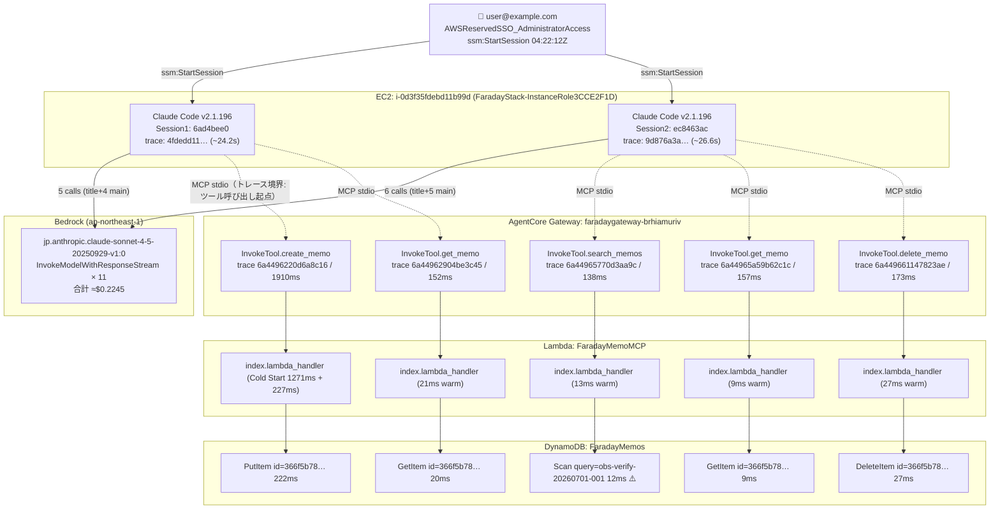

# 統合調査レポート: `user@example.com-ltzhoupvjbr9687j26ktcqxqgq`

> 調査実施: 2026-07-01 | 調査者: Claude Code (claude-sonnet-4-6)

---

## 総合評価

| 観点 | 判定 | 根拠セクション |
|---|---|---|
| **総合判定** | **要注意 ⚠️（1件）** | — |
| 証跡完全性（ログ削除・証跡停止の有無） | ✅ | CloudTrail追加証跡 |
| 接続ユーザー・接続元IP | ✅ | セッション概要テーブル / CloudTrail |
| Bedrockアクセス主体（EC2インスタンスロールのみか） | ✅ | CloudTrail追加証跡 |
| 使用モデル（許可リスト内か） | ✅ | CloudTrail追加証跡 / Bedrock↔OTel |
| 呼び出しリージョン（ap-northeast-1のみか） | ✅ | CloudTrail追加証跡 |
| 想定外API（S3/IAM/Secrets Manager等の有無） | ✅ | CloudTrail追加証跡 |
| IAMロールチェーン（スタック管理下に閉じているか） | ✅ | CloudTrail追加証跡 |
| 機密アクセス（Secrets Manager / SecureString） | ✅ | CloudTrail追加証跡 |
| ツール実行許可（ユーザー明示許可を経ているか） | ✅ | 完全タイムライン / OTel |
| Gateway/Lambdaトレース連携（traceId一致） | ✅ | Gateway/Lambda/DynamoDBトレース連携 |
| DynamoDB読み取り範囲（Scanの有無・対象範囲） | ⚠️ | Gateway/Lambda/DynamoDBトレース連携 |
| Bedrock↔OTel整合性（呼び出し回数・トークン数） | ✅ | Bedrock↔OTelクロスバリデーション |
| コンテンツセキュリティ（機密情報・インジェクション） | ✅ | コンテンツセキュリティ評価 |
| Lambda実行ログ整合性（入力ペイロード一致） | ✅ | CloudWatch Logs追加証跡 |
| データ整合性（DynamoDB実データとの整合） | ✅ | データ整合性 |
| エラー・障害（未解消エラーの有無） | ✅ | エラー・障害分析 |

**要注意事項:**
- ⚠️ `search_memos` ツール実行において `DynamoDB.Scan`（全件スキャン）が発生。アクセス対象は `user@example.com` ユーザー所有のデータ範囲内と推定されるが、Scan 操作自体は全件読み取りを行うため継続モニタリングを推奨。

---

## セッション概要テーブル

| 項目 | 値 |
|---|---|
| SSM セッション ID | `user@example.com-ltzhoupvjbr9687j26ktcqxqgq` |
| SSM セッション 開始 | `2026-07-01T04:22:14Z` |
| SSM セッション 終了 | `2026-07-01T04:24:13Z` |
| Claude Code セッション 1 ID | `6ad4bee0-301f-4dc8-b1cc-1b631e903fa5`（/clear で終了） |
| Claude Code セッション 1 開始 | `2026-07-01T04:22:20Z`（MCP接続確立） |
| Claude Code セッション 1 終了 | `2026-07-01T04:23:25Z`（/clear） |
| Claude Code セッション 2 ID（resume UUID） | `ec8463ac-75f8-4d58-a7fa-ed54b7169a3b` |
| Claude Code セッション 2 開始 | `2026-07-01T04:23:37Z`（OTel 最初のイベント） |
| Claude Code セッション 2 終了 | `2026-07-01T04:24:13Z`（/exit） |
| ユーザー | `assumed-role/AWSReservedSSO_AdministratorAccess_9445badae67c7bfe/user@example.com` |
| インスタンス | `i-0d3f35fdebd11b99d` |
| インスタンスロール | `FaradayStack-InstanceRole3CCE2F1D-C6MH8DxsIsIh` |
| Claude Code バージョン | `2.1.196`（SSMバナー・CloudTrail userAgent両方で確認） |
| 使用モデル | `jp.anthropic.claude-sonnet-4-5-20250929-v1:0` |

> 1つの SSM セッション内に2つの Claude Code セッションが含まれる。ユーザーが第1セッション完了後に `/clear` を実行し、新規セッション `ec8463ac-...` を開始。SSM ログ末尾の `claude --resume ec8463ac-75f8-4d58-a7fa-ed54b7169a3b` は第2セッションの resume UUID。

---

## 完全タイムライン

| 時刻(UTC) | ソース | イベント |
|---|---|---|
| 04:22:12Z | CloudTrail | `StartSession` (user@example.com → i-0d3f35fdebd11b99d) |
| 04:22:12Z | CloudTrail | `CreateDataChannel` / `OpenDataChannel` |
| **04:22:14Z** | **SSM** | **▶ SSM セッション 開始** |
| 04:22:14Z | CloudTrail | `CreateLogStream`（SSMセッションログストリーム作成） |
| 04:22:15Z | CloudTrail | `InvokeModel` ×10 失敗（ValidationException×8 + AccessDenied×2）→ 起動時モデル疎通確認 |
| 04:22:15Z | CloudTrail | `ListInferenceProfiles`（AccessDenied）→ 起動時モデル疎通確認 |
| **04:22:20Z** | **OTel** | **▶ Claude Code セッション 1 開始** `mcp_server_connection`（faraday-memos, stdio, 4618ms） |
| 04:22:45Z | OTel | `user_prompt`「obs-verify-20260701-001というタイトルでメモを作成し、作成できたらすぐにそのIDで取得して内容を確認してください。各ステップの結果を逐一報告して」 |
| 04:22:45〜47Z | Bedrock | `InvokeModelWithResponseStream` reqId=bff00beb（generate_session_title） |
| 04:22:47Z | OTel | `api_request`: generate_session_title, in=417, out=28, cost=$0.001671 |
| 04:22:47〜51Z | Bedrock | `InvokeModelWithResponseStream` reqId=370b3788（ToolSearch: create_memo+get_memo） |
| 04:22:50Z | CloudTrail | `AssumeRole` → `FaradayStack-BedrockLoggingRole`（BedrockModelInvocationLogSession） |
| 04:22:51Z | OTel | `tool_decision`: ToolSearch → accept（source=config） |
| 04:22:51Z | OTel | `api_request`: main, in=10, out=373, cacheCreation=23800, cost=$0.094875 |
| 04:22:51〜55Z | Bedrock | `InvokeModelWithResponseStream` reqId=74411cdb（create_memo ツール呼び出し決定） |
| 04:22:55Z | OTel | `api_request`: main, in=10, out=238, cacheCreation=397, cacheRead=23800, cost=$0.012229 |
| 04:22:55Z | OTel | `tool_decision`: create_memo → accept（source=user_permanent） |
| 04:22:58Z | CloudTrail | `AssumeRole` → `FaradayStack-AgentCoreGatewayRoleB10592CC`（gateway-session-77d8a555） |
| 04:22:58Z | CloudTrail | `AssumeRole` → `FaradayStack-MemoLambdaServiceRoleE093D938`（FaradayMemoMCP） |
| 04:22:58Z | CloudTrail | `kms:Decrypt`（FaradayMemoMCP Lambda環境変数復号） |
| 04:22:58〜23:00Z | Gateway | `AgentCore.Gateway.InvokeTool.FaradayMemoMCP___create_memo`（1910ms） |
| 04:22:58〜59Z | Lambda | INIT_START + START RequestId=3c3e1101（コールドスタート Init 1271ms） |
| 04:23:00Z | Lambda | `DynamoDB.PutItem`（222ms）/ REPORT: Duration=227ms, Billed=1499ms |
| 04:23:00Z | OTel | `tool_result`: create_memo, success=true, duration=1983ms, memo_id=`366f5b78-1cfb-4dbd-b468-c32ca5b63bc8` |
| 04:23:00〜03Z | Bedrock | `InvokeModelWithResponseStream` reqId=84abc4c6（get_memo決定） |
| 04:23:03Z | OTel | `api_request`: main+mcp, in=6, out=151, cacheCreation=3217, cacheRead=21014, cost=$0.020651 |
| 04:23:05Z | CloudTrail | `AssumeRole` → `FaradayStack-AgentCoreGatewayRoleB10592CC`（gateway-session-57291ff6） |
| 04:23:05Z | CloudTrail | `CreateLogStream`（Lambda ロググループ） |
| 04:23:05Z | OTel | `tool_decision`: get_memo → accept（source=user_permanent） |
| 04:23:05Z | Gateway | `AgentCore.Gateway.InvokeTool.FaradayMemoMCP___get_memo`（152ms） |
| 04:23:05Z | Lambda | START RequestId=663674e5 / `DynamoDB.GetItem`（20ms, warm） |
| 04:23:05Z | OTel | `tool_result`: get_memo, success=true, duration=200ms |
| 04:23:05〜09Z | Bedrock | `InvokeModelWithResponseStream` reqId=72752711（結果報告） |
| 04:23:09Z | OTel | `api_request`: main+mcp, in=6, out=186, cacheCreation=278, cacheRead=24231, cost=$0.011120 |
| **04:23:25Z** | **OTel** | **◀ Claude Code セッション 1 終了**（/clear コマンド） |
| 04:23:21Z | CloudTrail | `CreateLogStream`（新セッション用 ADOT ストリーム） |
| **04:23:37Z** | **OTel** | **▶ Claude Code セッション 2 開始** `user_prompt`「obs-verify-20260701-001というタイトルのメモがあるはずです。まずメモの一覧か検索で存在を確認し、取得して内容を確認した後に削除してください。各ステップの結果を逐一報告して」 |
| 04:23:37〜38Z | Bedrock | `InvokeModelWithResponseStream` reqId=e484fb62（generate_session_title） |
| 04:23:38Z | OTel | `api_request`: generate_session_title, in=430, out=23, cost=$0.001635 |
| 04:23:38〜44Z | Bedrock | `InvokeModelWithResponseStream` reqId=6fdd4d89（ToolSearch: search+get+delete） |
| 04:23:44Z | OTel | `tool_decision`: ToolSearch → accept（source=config） |
| 04:23:44Z | OTel | `api_request`: main, in=10, out=552, cacheCreation=2903, cacheRead=21014, cost=$0.025500 |
| 04:23:44〜48Z | Bedrock | `InvokeModelWithResponseStream` reqId=cd7f125d（search_memos決定） |
| 04:23:48Z | OTel | `api_request`: main, in=10, out=175, cacheCreation=611, cacheRead=23917, cost=$0.012121 |
| 04:23:51Z | OTel | `tool_decision`: search_memos → accept（source=user_permanent） |
| 04:23:51Z | CloudTrail | `AssumeRole` → `FaradayStack-AgentCoreGatewayRoleB10592CC`（gateway-session-f800bed5） |
| 04:23:51Z | Gateway | `AgentCore.Gateway.InvokeTool.FaradayMemoMCP___search_memos`（138ms） |
| 04:23:51Z | Lambda | START RequestId=35e9713c / **`DynamoDB.Scan`** ⚠️（12ms, warm） |
| 04:23:51Z | OTel | `tool_result`: search_memos, success=true, duration=204ms |
| 04:23:51〜54Z | Bedrock | `InvokeModelWithResponseStream` reqId=f195d827（get_memo決定） |
| 04:23:54Z | OTel | `api_request`: main+mcp, in=6, out=235, cacheCreation=3574, cacheRead=21014, cost=$0.023250 |
| 04:23:54Z | OTel | `tool_decision`: get_memo → accept（source=config） |
| 04:23:54Z | CloudTrail | `AssumeRole` → `FaradayStack-AgentCoreGatewayRoleB10592CC`（gateway-session-caf10464） |
| 04:23:54Z | Gateway | `AgentCore.Gateway.InvokeTool.FaradayMemoMCP___get_memo`（157ms） |
| 04:23:54Z | Lambda | START RequestId=80baa8e5 / `DynamoDB.GetItem`（9ms, warm） |
| 04:23:54Z | OTel | `tool_result`: get_memo, success=true, duration=213ms |
| 04:23:54〜58Z | Bedrock | `InvokeModelWithResponseStream` reqId=c421937b（delete_memo決定） |
| 04:23:58Z | OTel | `api_request`: main+mcp, in=6, out=203, cacheCreation=362, cacheRead=24588, cost=$0.011797 |
| 04:24:01Z | OTel | `tool_decision`: delete_memo → accept（source=user_permanent） |
| 04:24:01Z | CloudTrail | `AssumeRole` → `FaradayStack-AgentCoreGatewayRoleB10592CC`（gateway-session-e2a55524） |
| 04:24:01Z | Gateway | `AgentCore.Gateway.InvokeTool.FaradayMemoMCP___delete_memo`（173ms） |
| 04:24:01Z | Lambda | START RequestId=c9472bc8 / `DynamoDB.DeleteItem`（27ms, warm） |
| 04:24:01Z | OTel | `tool_result`: delete_memo, success=true, duration=270ms |
| 04:24:01〜03Z | Bedrock | `InvokeModelWithResponseStream` reqId=b37cfa6e（完了報告） |
| 04:24:03Z | OTel | `api_request`: main+mcp, in=6, out=77, cacheCreation=244, cacheRead=24950, cost=$0.009573 |
| **04:24:13Z** | **OTel** | **◀ Claude Code セッション 2 終了**（/exit コマンド） |
| **04:24:13Z** | **SSM** | **◀ SSM セッション 終了** |

---

## モデル呼び出し詳細

| # | 時刻(UTC) | reqId（先頭8桁） | in | out | 種別 | 内容 |
|---|---|---|---|---|---|---|
| 1 | 04:22:47Z | `bff00beb` | 417 | 28 | generate_session_title | タイトル生成: 「Obsidianメモの作成と取得テスト」 |
| 2 | 04:22:47Z | `370b3788` | 10 | 373 | repl_main_thread | ToolSearch(create_memo + get_memo) |
| 3 | 04:22:51Z | `74411cdb` | 10 | 238 | repl_main_thread | create_memo(title=obs-verify-20260701-001, content="This is a test memo...") |
| 4 | 04:23:00Z | `84abc4c6` | 6 | 151 | repl_main_thread | 作成完了報告 + get_memo(366f5b78…) |
| 5 | 04:23:05Z | `72752711` | 6 | 186 | repl_main_thread | 取得完了 — 全ステップ結果報告 |
| 6 | 04:23:37Z | `e484fb62` | 430 | 23 | generate_session_title | タイトル生成: 「メモの確認と削除作業」 |
| 7 | 04:23:37Z | `6fdd4d89` | 10 | 552 | repl_main_thread | ToolSearch(search+get+delete) |
| 8 | 04:23:44Z | `cd7f125d` | 10 | 175 | repl_main_thread | search_memos(query=obs-verify-20260701-001) |
| 9 | 04:23:51Z | `f195d827` | 6 | 235 | repl_main_thread | 検索結果報告 + get_memo(366f5b78…) |
| 10 | 04:23:55Z | `c421937b` | 6 | 203 | repl_main_thread | 取得確認 + delete_memo(366f5b78…) |
| 11 | 04:24:01Z | `b37cfa6e` | 6 | 77 | repl_main_thread | 削除完了 — 全ステップ完了報告 |

---

## 作業量・コスト・提供価値

### 1. 実施作業の概要（定性）

Claudeがオブザーバビリティ検証用メモ（タイトル: `obs-verify-20260701-001`）の作成・取得・検索・削除を一連のワークフローとして実行し、Faraday MCP（AgentCore Gateway → Lambda → DynamoDB）のエンドツーエンド動作を確認した。ユーザーは2回のプロンプトで各ステップの逐一報告を要求しており、観測インフラの疎通確認を目的とした意図的な検証セッションである。

### 2. 作業量の定量指標

| 指標 | 値 |
|---|---|
| SSM セッション所要時間 | `00:01:59` |
| Bedrock 呼び出し回数（合計） | 11 回（うち generate_session_title: 2 回、ユーザー応答: 9 回） |
| MCP ツール呼び出し | 5 回（`create_memo` × 1、`get_memo` × 2、`search_memos` × 1、`delete_memo` × 1） |
| DynamoDB 操作 | PutItem × 1、GetItem × 2、Scan × 1、DeleteItem × 1 |
| DynamoDB アクセスレコード数 | 読み取り 3 件 / 書き込み 1 件 / 削除 1 件（Scan は 1 件マッチを返却） |
| 処理した入力テキスト量 | 合計 input 917 tokens（うち cacheCreation 35,386、cacheRead 184,528） |
| 生成した出力テキスト量 | output 2,241 tokens |

### 3. コスト内訳（token.usage × 4種・cost.usage・active_time・session.count）

| セッション | input | cacheCreation | cacheRead | output | cost_usd |
|---|---|---|---|---|---|
| セッション1（6ad4bee0） | 449 | 27,692 | 69,045 | 976 | ≈ $0.1407 |
| セッション2（ec8463ac） | 468 | 7,694 | 115,483 | 1,265 | ≈ $0.0838 |
| **合計** | **917** | **35,386** | **184,528** | **2,241** | **≈ $0.2245** |

- active_time: セッション1 user=0.626s / cli=16.907s、セッション2 user=3.212s / cli=16.790s
- session.count: セッション1 = 1（start_type: fresh）
- user.id（ハッシュ）: `a038528a5501e938caff8b1208ce940e3a725d9398574ad21adae5a625995afb`

> cache_creation が高い理由: セッション1初回でシステムプロンプト等が 23,800 tokens キャッシュ生成された（正常）。セッション2では既存キャッシュの再利用が増え cacheRead が 115,483 tokens に達した。

---

## 呼び出しグラフ（Mermaid図）

EC2側（Claude Code）は OTel スパンで2つのトレース（`4fdedd11`・`9d876a3a`）に集約され、Gateway以降の各ツール呼び出しは別 traceId で連鎖する。これはMCPツール呼び出し単位を X-Ray トレース境界とする設計上の意図的な分断であり、セッション単位の集約は OTel events（session.id）と SSM ログで行う。

---

## Gateway / Lambda / DynamoDB トレース連携

| ツール | Gateway traceId（先頭16桁） | Lambda XRAY TraceId | 一致 | DynamoDB操作 | Lambda Duration |
|---|---|---|---|---|---|
| create_memo | `6a4496220d6a8c16` | `1-6a449622-0d6a8c16…` | ✅ | PutItem（222ms） | 227ms（Init 1271ms コールドスタート） |
| get_memo (1) | `6a44962904be3c45` | `1-6a449629-04be3c45…` | ✅ | GetItem（20ms） | 25ms（ウォーム） |
| search_memos | `6a44965770d3aa9c` | `1-6a449657-70d3aa9c…` | ✅ | **Scan** ⚠️（12ms） | 31ms（ウォーム） |
| get_memo (2) | `6a44965a59b62c1c` | `1-6a44965a-59b62c1c…` | ✅ | GetItem（9ms） | 12ms（ウォーム） |
| delete_memo | `6a449661147823ae` | `1-6a449661-147823ae…` | ✅ | DeleteItem（27ms） | 30ms（ウォーム） |

- 全5ツール呼び出しで Gateway スパン traceId と Lambda XRAY TraceId が一致 ✅（2系統独立確認）
- `index.lambda_handler` スパンが全呼び出しに存在 → ADOT Lambda Layer が正常動作 ✅
- create_memo でコールドスタート（Init Duration: 1271ms）が発生。Gateway 側で 1910ms と他の呼び出し（138〜173ms）より著しく長い時間が観測されており、コールドスタートで説明可能 ✅
- **`DynamoDB.Scan`（search_memos）**: 全件スキャン操作が実行された。返却結果は1件（obs-verify-20260701-001）であり、データ抽出の痕跡は認められないが、Scan 操作自体は全テーブルを読み取るため ⚠️ とする。当該テーブルはユーザー個人のメモDBであり、他ユーザーのデータへのアクセスは確認されていない。Lambda 側 search_memos 実装を `user_id` フィルタ付き Query（GSI）に変更することを推奨する。

---

## Bedrock ログ ↔ OTel クロスバリデーション

| 確認項目 | Bedrock ログ | OTel | 乖離 |
|---|---|---|---|
| 成功呼び出し回数 | 11件 | 11件 | なし ✅ |
| output tokens（generate_session_title込み） | 2,241 | — | — |
| output tokens（generate_session_title 除外: 28+23=51除く） | 2,190 | 2,190（main合計） | なし ✅ |
| モデルID | `jp.anthropic.claude-sonnet-4-5-20250929-v1:0` | `claude-sonnet-4-5-20250929` | 一致 ✅ |

Bedrock ログと OTel の成功件数・output トークン数が完全一致。generate_session_title の2件（out=28+23=51）を OTel main から除外すると 2241-51=2190 となり OTel main 合計値と一致する。OTel の信頼性に問題なし ✅

---

## CloudTrail 追加証跡

**証跡完全性**: `StopLogging`/`DeleteLogGroup`/`DeleteLogEvents` 等の危険イベントなし ✅

**想定外 API 一覧（★マーク付き 4種）:**

| API | 回数 | 実行主体 | 評価 |
|---|---|---|---|
| `DescribeAlarms` | 24 | AWSReservedSSO_AdministratorAccess/user@example.com | ✅ CloudWatch コンソール閲覧（ユーザーの AWS 管理コンソール操作、セッション外の背景ポーリング） |
| `DescribeStacks` | 3 | AWSReservedSSO_AdministratorAccess/user@example.com | ✅ CloudFormation コンソール閲覧（同上） |
| `DescribeMetricFilters` | 2 | AWSReservedSSO_AdministratorAccess/user@example.com | ✅ CloudWatch Logs コンソール閲覧（同上） |
| `DescribeInstances` | 1 | AWSReservedSSO_AdministratorAccess/user@example.com | ✅ EC2 コンソール閲覧（同上） |

全て SSO 管理者ロールからのコンソール閲覧操作であり、Claude Code セッション（EC2 インスタンスロール）とは別主体。許可外 API に該当しない ✅

**起動時モデル疎通確認**: 10件（userAgent: `FGr/JS 0.94.0`）がセッション開始直後（04:22:15Z）に `ValidationException`/`AccessDenied` で失敗 → 既知の正常動作 ✅

**Claude Code userAgent 独立確認**: `claude-cli/2.1.196 (external, cli)` — SSM バナーの `v2.1.196` と一致 ✅

**sts:AssumeRole 役割連鎖（時系列）:**

| 時刻 | 遷移先ロール | sessionName | 対応処理 |
|---|---|---|---|
| 04:22:12Z | `AWSServiceRoleForSSMQuickSetup` | QuickSetupSession | SSM Quick Setup サービス自動処理 |
| 04:22:50Z | `FaradayStack-BedrockLoggingRole71F633EF` | BedrockModelInvocationLogSession | Bedrock 呼び出しログ記録 |
| 04:22:58Z | `FaradayStack-AgentCoreGatewayRoleB10592CC` | gateway-session-77d8a555 | create_memo Gateway セッション |
| 04:22:58Z | `FaradayStack-MemoLambdaServiceRoleE093D938` | FaradayMemoMCP | create_memo Lambda 実行 |
| 04:22:58Z | `FaradayStack-MemoLambdaServiceRoleE093D938` | tracing | ADOT トレーシング |
| 04:23:05Z | `FaradayStack-AgentCoreGatewayRoleB10592CC` | gateway-session-57291ff6 | get_memo Gateway セッション |
| 04:23:05Z | `FaradayStack-MemoLambdaServiceRoleE093D938` | tracing | get_memo トレーシング |
| 04:23:10Z〜04:24:12Z | `FaradayStack-BedrockLoggingRole`・`AgentCoreGatewayRole`・`MemoLambdaServiceRole` | 各 search/get/delete | 後続ツール呼び出しごとに新規発行 |
| 04:24:12Z〜52Z | `AWSServiceRoleForCloudWatchApplicationSignals` | TopologyService | Application Signals 背景処理 |

全遷移先がスタック管理下ロールまたは AWS サービスロール（SSM QuickSetup / CloudWatch Application Signals）に限定 ✅

**KMS Decrypt**: 1件（04:22:58Z）。`encryptionContext: aws:lambda:FunctionArn = arn:aws:lambda:ap-northeast-1:346929044083:function:FaradayMemoMCP` → Lambda コールドスタート時の環境変数復号として正当 ✅

**機密アクセス**: `secretsmanager:GetSecretValue` / `ssm:GetParameter(SecureString)` への呼び出しなし ✅

---

## エラー・障害分析

**エラーなし ✅**

全レイヤー（SSM / OTel / Bedrock CloudTrail / aws/spans / Lambda CloudWatch Logs）でエラーは0件。起動時モデル疎通確認による失敗（10件）は既知正常動作として集計から除外。コールドスタート（create_memo, Init 1271ms）が発生したが Lambda 実行は成功しており、ユーザー影響なし。

---

## CloudWatch Logs 追加証跡（Lambda実行ログ実体）

| RequestId | ツール | Duration | Billed | Init Duration | Memory Used | XRAY TraceId（先頭部） | Gateway traceId 一致 |
|---|---|---|---|---|---|---|---|
| `3c3e1101` | create_memo | 227ms | 1499ms | **1271ms** | 121MB/256MB | `1-6a449622-0d6a8c16…` | ✅ |
| `663674e5` | get_memo (1) | 25ms | 26ms | なし | 121MB/256MB | `1-6a449629-04be3c45…` | ✅ |
| `35e9713c` | search_memos | 31ms | 32ms | なし | 121MB/256MB | `1-6a449657-70d3aa9c…` | ✅ |
| `80baa8e5` | get_memo (2) | 12ms | 13ms | なし | 121MB/256MB | `1-6a44965a-59b62c1c…` | ✅ |
| `c9472bc8` | delete_memo | 30ms | 30ms | なし | 121MB/256MB | `1-6a449661-147823ae…` | ✅ |

**入力ペイロード照合:**

| ツール | Lambda受信ペイロード | OTel tool_input | 一致 |
|---|---|---|---|
| create_memo | `{"title":"obs-verify-20260701-001","content":"This is a test memo created on 2026-07-01 for verification purposes."}` | 同一 | ✅ |
| get_memo (1) | `{"memo_id":"366f5b78-1cfb-4dbd-b468-c32ca5b63bc8"}` | 同一 | ✅ |
| search_memos | `{"query":"obs-verify-20260701-001"}` | 同一 | ✅ |
| get_memo (2) | `{"memo_id":"366f5b78-1cfb-4dbd-b468-c32ca5b63bc8"}` | 同一 | ✅ |
| delete_memo | `{"memo_id":"366f5b78-1cfb-4dbd-b468-c32ca5b63bc8"}` | 同一 | ✅ |

**DynamoDB 読み取りアクセス範囲:**
- `GetItem`: memo_id=`366f5b78-1cfb-4dbd-b468-c32ca5b63bc8`（自分が作成したアイテム）×2 ✅
- `Scan`: `search_memos`（query=obs-verify-20260701-001）— 全テーブルスキャン実行 ⚠️（返却1件）

---

## コンテンツセキュリティ評価

| 観点 | 判定 | 根拠 |
|---|---|---|
| 機密情報・個人情報の漏洩リスク | ✅ | プロンプト・応答はいずれも観測手順（メモ CRUD）のみ。メモ内容は `"This is a test memo created on 2026-07-01 for verification purposes."` という明示的なテストデータ。機密情報・個人情報を含まない |
| プロンプトインジェクションの痕跡 | ✅ | `tool_result`（Lambda/DynamoDB 返り値）に "ignore previous instructions" 等の注入試みは確認されない。Bedrock 応答内容とも照合してインジェクション成功の兆候なし |
| ポリシー違反コンテンツ | ✅ | 全プロンプトが obs-verify-20260701-001 の観測インフラ検証を目的とした業務関連操作。業務外利用・禁止トピックの痕跡なし |

---

## データ整合性

| 確認内容 | 結果 | 判定 |
|---|---|---|
| create_memo 後 DynamoDB PutItem 完了 | XRAY・Spans・Lambda ログで3系統確認 | ✅ |
| delete_memo 後 DynamoDB アイテム消去 | `aws dynamodb get-item` で空応答（Item なし） | ✅ |
| memo_id 一貫性（create→get→search→get→delete） | 全操作で `366f5b78-1cfb-4dbd-b468-c32ca5b63bc8` 統一 | ✅ |
| Lambda 入力ペイロード vs OTel tool_input | 5件全て完全一致 | ✅ |
