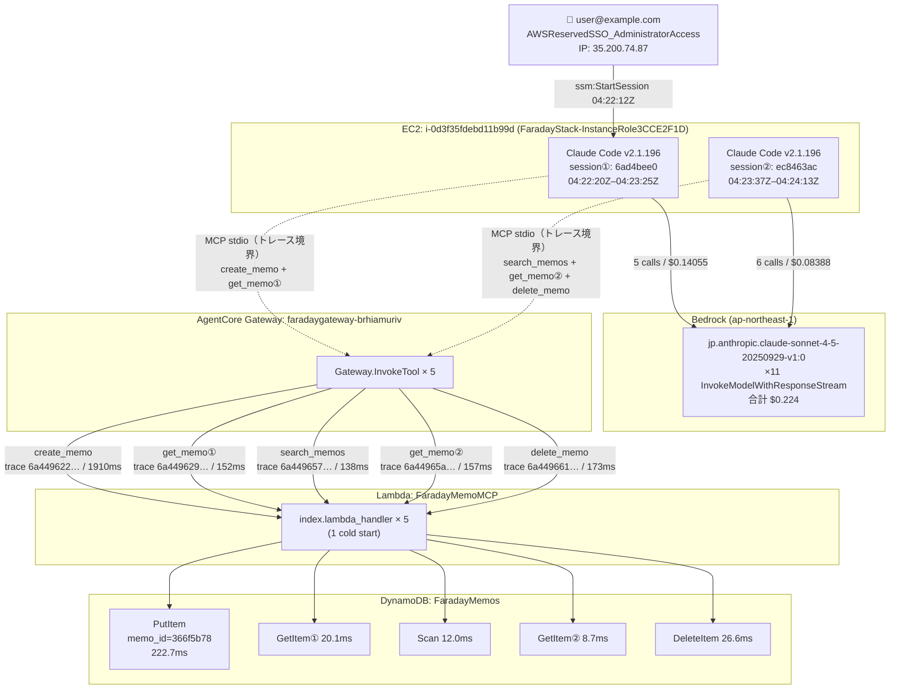

# セッション調査レポート
**調査対象 SSM セッション ID**: `user@example.com-ltzhoupvjbr9687j26ktcqxqgq`  
**調査実施日時**: 2026-07-01T05:00:00Z（独立調査・過去レポート参照なし）

---

## セッション概要テーブル

| 項目 | 値 |
|---|---|
| SSM セッション ID | `user@example.com-ltzhoupvjbr9687j26ktcqxqgq` |
| SSM セッション 開始 | `2026-07-01T04:22:14Z` |
| SSM セッション 終了 | `2026-07-01T04:24:13Z` |
| Claude Code セッション ID①（session1） | `6ad4bee0-301f-4dc8-b1cc-1b631e903fa5` |
| Claude Code セッション① 開始 | `2026-07-01T04:22:20Z`（OTel mcp_server_connection） |
| Claude Code セッション① 終了 | `2026-07-01T04:23:25Z`（/clear コマンド） |
| Claude Code セッション ID②（resume UUID） | `ec8463ac-75f8-4d58-a7fa-ed54b7169a3b` |
| Claude Code セッション② 開始 | `2026-07-01T04:23:37Z`（OTel 最初のイベント） |
| Claude Code セッション② 終了 | `2026-07-01T04:24:13Z`（/exit コマンド） |
| ユーザー | `assumed-role/AWSReservedSSO_AdministratorAccess_9445badae67c7bfe/user@example.com` |
| 接続元 IP | `35.200.74.87` |
| インスタンス | `i-0d3f35fdebd11b99d` |
| インスタンスロール | `FaradayStack-InstanceRole3CCE2F1D-C6MH8DxsIsIh` |
| SSM ドキュメント | `FaradayStack-ClaudeSessionDocument-5YfSwyzLMCdv` |
| Claude Code バージョン | `v2.1.196` |
| 使用モデル | `jp.anthropic.claude-sonnet-4-5-20250929-v1:0` |

> **1 つの SSM セッション内に 2 つの Claude Code セッションが含まれる**。ユーザーが第1セッション完了後に `/clear` を実行し、新規セッション `ec8463ac-...` を開始。SSM ログ末尾の `claude --resume ec8463ac-75f8-4d58-a7fa-ed54b7169a3b` は第2セッションの resume UUID。

---

## 完全タイムライン

| 時刻(UTC) | ソース | イベント |
|---|---|---|
| 04:22:09 | CloudTrail | DescribeStacks（`user@example.com` コンソール操作） |
| 04:22:11 | CloudTrail | DescribeInstances（`user@example.com` コンソール操作） |
| 04:22:12 | CloudTrail | AssumeRole → AWSServiceRoleForSSMQuickSetup |
| 04:22:12 | CloudTrail | **StartSession** (target=i-0d3f35fdebd11b99d) |
| 04:22:12 | CloudTrail | CreateDataChannel / OpenDataChannel |
| 04:22:12 | CloudTrail | DescribeLogGroups（ADOT ストリーム存在確認） |
| **04:22:14** | **SSM** | **▶ SSM セッション 開始** |
| 04:22:14 | CloudTrail | CreateLogStream（ADOT ストリーム作成） |
| 04:22:15 | CloudTrail | InvokeModel ×10（ValidationException×8 + AccessDenied×2）— 起動時モデル疎通確認（userAgent: FGr/JS 0.94.0） |
| 04:22:15 | CloudTrail | ListInferenceProfiles（AccessDenied）— 同上（起動時モデル疎通確認） |
| **04:22:20** | **OTel** | **▶ Claude Code セッション① 開始** mcp_server_connection: faraday-memos 接続完了（4618ms） |
| 04:22:31 | CloudTrail | CreateLogStream（ResourceAlreadyExistsException — 冪等操作、正常） |
| 04:22:45 | OTel | user_prompt: 「obs-verify-20260701-001 というタイトルでメモを作成し、IDで取得して内容を確認してください。各ステップを逐一報告して」 |
| 04:22:47 | Bedrock | InvokeModelWithResponseStream reqId=bff00beb → セッションタイトル「Obsidianメモの作成と取得テスト」 |
| 04:22:47 | OTel | api_request: generate_session_title, in=417, out=28, cost=$0.001671 |
| 04:22:47 | Bedrock | InvokeModelWithResponseStream reqId=370b3788 → ToolSearch(create_memo+get_memo) |
| 04:22:50 | CloudTrail | AssumeRole → FaradayStack-BedrockLoggingRole（BedrockModelInvocationLogSession） |
| 04:22:51 | OTel | tool_decision: ToolSearch → accept（source=config） |
| 04:22:51 | OTel | api_request: main, in=10, out=373, cacheCreation=23800, cost=$0.09488 |
| 04:22:52 | Bedrock | InvokeModelWithResponseStream reqId=74411cdb → create_memo ツール呼び出し |
| 04:22:51 | OTel | api_request: main, in=10, out=238, cacheCreation=397, cacheRead=23800, cost=$0.01223 |
| 04:22:55 | Bedrock | InvokeModelWithResponseStream reqId=84abc4c6 → create_memo 実行 |
| 04:22:58 | CloudTrail | AssumeRole ×4: BedrockLoggingRole + AgentCoreGatewayRole(gateway-session-77d8a555) + MemoLambdaServiceRole(tracing+FaradayMemoMCP) |
| 04:22:58 | CloudTrail | kms:Decrypt（FaradayMemoMCP 環境変数復号） |
| 04:22:58 | aws/spans | AgentCore.Gateway.InvokeTool.FaradayMemoMCP___create_memo（1910ms, traceId=6a4496220d6a8c161a77…） |
| 04:22:58 | Lambda | INIT_START + START RequestId=3c3e1101（コールドスタート） |
| 04:22:58 | Lambda | 入力: `{"title":"obs-verify-20260701-001","content":"This is a test memo created on 2026-07-01 for verification purposes."}` |
| 04:22:58 | aws/spans | DynamoDB.PutItem（222.7ms） |
| 04:22:58 | Lambda | REPORT 3c3e1101: Duration=227ms, Billed=1499ms, Init Duration=1271ms |
| 04:22:58 | Lambda | XRAY TraceId=1-6a449622-0d6a8c161a77f693228b8892 ✓ |
| 04:23:00 | OTel | tool_result: create_memo, success=true, duration=1983ms |
| 04:23:03 | OTel | api_request: main+mcp, in=6, out=151, cacheCreation=3217, cacheRead=21014, cost=$0.02065 |
| 04:23:03 | Bedrock | reqId=84abc4c6 → 「作成完了: memo_id=366f5b78-1cfb-4dbd-b468-c32ca5b63bc8」 |
| 04:23:05 | CloudTrail | AssumeRole ×3: BedrockLoggingRole + AgentCoreGatewayRole(gateway-session-57291ff6) + MemoLambdaServiceRole(tracing) |
| 04:23:05 | CloudTrail | CreateLogStream（Lambda ロググループ） |
| 04:23:05 | aws/spans | AgentCore.Gateway.InvokeTool.FaradayMemoMCP___get_memo（152ms, traceId=6a44962904be3c455b2b…） |
| 04:23:05 | Lambda | START RequestId=663674e5（ウォームスタート）/ 入力: `{"memo_id":"366f5b78-1cfb-4dbd-b468-c32ca5b63bc8"}` |
| 04:23:05 | aws/spans | DynamoDB.GetItem（20.1ms） |
| 04:23:05 | Lambda | REPORT 663674e5: Duration=25ms, Billed=26ms / XRAY TraceId=1-6a449629-04be3c455b2b… ✓ |
| 04:23:05 | OTel | tool_result: get_memo①, success=true, duration=200ms |
| 04:23:09 | OTel | api_request: main+mcp, in=6, out=186, cacheCreation=278, cacheRead=24231, cost=$0.01112 |
| 04:23:09 | Bedrock | reqId=72752711 → 「取得完了 / 結果サマリー（ID・タイトル・内容・作成日時）」 |
| **04:23:25** | **OTel** | **◀ Claude Code セッション① 終了**（/clear コマンド） |
| 04:23:21 | CloudTrail | CreateLogStream（新セッション用 ADOT ストリーム） |
| **04:23:37** | **OTel** | **▶ Claude Code セッション② 開始** |
| 04:23:37 | OTel | user_prompt: 「obs-verify-20260701-001 というタイトルのメモを検索・取得・削除してください。各ステップを逐一報告して」 |
| 04:23:38 | Bedrock | reqId=e484fb62 → セッションタイトル「メモの確認と削除作業」 |
| 04:23:38 | OTel | api_request: generate_session_title, in=430, out=23, cost=$0.001635 |
| 04:23:38 | Bedrock | reqId=6fdd4d89 → ToolSearch(search+get+delete) |
| 04:23:44 | OTel | tool_decision: ToolSearch → accept（source=config） |
| 04:23:44 | OTel | api_request: main, in=10, out=552, cacheCreation=2903, cacheRead=21014, cost=$0.02550 |
| 04:23:44 | Bedrock | reqId=cd7f125d → search_memos(query="obs-verify-20260701-001") |
| 04:23:44 | OTel | api_request: main, in=10, out=175, cacheCreation=611, cacheRead=23917, cost=$0.01212 |
| 04:23:40 | CloudTrail | AssumeRole → BedrockLoggingRole |
| 04:23:50–51 | CloudTrail | AssumeRole ×3: BedrockLoggingRole + AgentCoreGatewayRole(gateway-session-f800bed5) + MemoLambdaServiceRole(tracing) |
| 04:23:51 | aws/spans | AgentCore.Gateway.InvokeTool.FaradayMemoMCP___search_memos（138ms, traceId=6a44965770d3aa9c3fae…） |
| 04:23:51 | Lambda | START RequestId=35e9713c / 入力: `{"query":"obs-verify-20260701-001"}` |
| 04:23:51 | aws/spans | **DynamoDB.Scan**（12ms） |
| 04:23:51 | Lambda | REPORT 35e9713c: Duration=31ms, Billed=32ms / XRAY TraceId=1-6a449657-70d3aa9c3fae… ✓ |
| 04:23:51 | OTel | tool_result: search_memos, success=true, duration=204ms |
| 04:23:52 | Bedrock | reqId=f195d827 → 「ステップ1: メモが見つかりました (ID=366f5b78…)」 + get_memo呼び出し |
| 04:23:54 | OTel | api_request: main+mcp, in=6, out=235, cacheCreation=3574, cacheRead=21014, cost=$0.02325 |
| 04:23:54 | CloudTrail | AssumeRole ×4: BedrockLoggingRole + AgentCoreGatewayRole(gateway-session-caf10464) + MemoLambdaServiceRole ×2 |
| 04:23:54 | aws/spans | AgentCore.Gateway.InvokeTool.FaradayMemoMCP___get_memo（157ms, traceId=6a44965a59b62c1c4c51…） |
| 04:23:54 | Lambda | START RequestId=80baa8e5 / 入力: `{"memo_id":"366f5b78-1cfb-4dbd-b468-c32ca5b63bc8"}` |
| 04:23:54 | aws/spans | DynamoDB.GetItem（8.7ms） |
| 04:23:54 | Lambda | REPORT 80baa8e5: Duration=12ms, Billed=13ms / XRAY TraceId=1-6a44965a-59b62c1c4c51… ✓ |
| 04:23:54 | OTel | tool_result: get_memo②, success=true, duration=213ms |
| 04:23:56 | Bedrock | reqId=c421937b → 「ステップ2: メモ内容確認」 + delete_memo呼び出し |
| 04:23:58 | OTel | api_request: main+mcp, in=6, out=203, cacheCreation=362, cacheRead=24588, cost=$0.01180 |
| 04:24:00–01 | CloudTrail | AssumeRole ×4: BedrockLoggingRole + AgentCoreGatewayRole(gateway-session-e2a55524) + MemoLambdaServiceRole ×2 |
| 04:24:01 | OTel | tool_decision: delete_memo → accept（source=user_permanent） |
| 04:24:01 | aws/spans | AgentCore.Gateway.InvokeTool.FaradayMemoMCP___delete_memo（173ms, traceId=6a449661147823ae6f6b…） |
| 04:24:01 | Lambda | START RequestId=c9472bc8 / 入力: `{"memo_id":"366f5b78-1cfb-4dbd-b468-c32ca5b63bc8"}` |
| 04:24:01 | aws/spans | DynamoDB.DeleteItem（26.6ms） |
| 04:24:01 | Lambda | REPORT c9472bc8: Duration=30ms, Billed=30ms / XRAY TraceId=1-6a449661-147823ae6f6b… ✓ |
| 04:24:01 | OTel | tool_result: delete_memo, success=true, duration=270ms |
| 04:24:03 | Bedrock | reqId=b37cfa6e → 「ステップ3: 削除完了 / 全操作正常完了」 |
| 04:24:03 | OTel | api_request: main+mcp, in=6, out=77, cacheCreation=244, cacheRead=24950, cost=$0.00957 |
| **04:24:13** | **OTel** | **◀ Claude Code セッション② 終了**（/exit コマンド） |
| **04:24:13** | **SSM** | **◀ SSM セッション 終了** |

---

## モデル呼び出し詳細（11 件）

| # | 時刻(UTC) | reqId（先頭8字） | query_source | 操作概要 |
|---|---|---|---|---|
| 1 | 04:22:47 | bff00beb | generate_session_title | セッションタイトル生成「Obsidianメモの作成と取得テスト」 |
| 2 | 04:22:47 | 370b3788 | repl_main_thread | ToolSearch(create_memo+get_memo) |
| 3 | 04:22:51 | 74411cdb | repl_main_thread | create_memo(title="obs-verify-20260701-001", content="This is a test memo...") |
| 4 | 04:23:00 | 84abc4c6 | repl_main_thread | create_memo結果受領 → get_memo(memo_id=366f5b78) |
| 5 | 04:23:05 | 72752711 | repl_main_thread | get_memo①結果受領 → 取得完了・結果サマリー出力 |
| 6 | 04:23:37 | e484fb62 | generate_session_title | セッションタイトル生成「メモの確認と削除作業」 |
| 7 | 04:23:37 | 6fdd4d89 | repl_main_thread | ToolSearch(list+search+get+delete) |
| 8 | 04:23:44 | cd7f125d | repl_main_thread | search_memos(query="obs-verify-20260701-001") |
| 9 | 04:23:51 | f195d827 | repl_main_thread | search_memos結果受領「ステップ1: 見つかった」 + get_memo呼び出し |
| 10 | 04:23:55 | c421937b | repl_main_thread | get_memo②結果受領「ステップ2: 内容確認」 + delete_memo呼び出し |
| 11 | 04:24:01 | b37cfa6e | repl_main_thread | delete_memo結果受領「ステップ3: 削除完了 / 全操作正常完了」 |

---

## コスト・トークン分析

### セッション①（6ad4bee0）

| 指標 | 値 |
|---|---|
| input_tokens | 449 |
| output_tokens | 976 |
| cache_creation_tokens | 27,692 |
| cache_read_tokens | 69,045 |
| cost_usd | **$0.14055** |
| active_time_user | 0.626s |
| active_time_cli | 16.907s |
| session.count | 1（start_type=fresh） |

### セッション②（ec8463ac）

| 指標 | 値 |
|---|---|
| input_tokens | 468 |
| output_tokens | 1,265 |
| cache_creation_tokens | 7,694 |
| cache_read_tokens | 115,483 |
| cost_usd | **$0.08388** |
| active_time_user | 3.212s |
| active_time_cli | 16.790s |

### SSM セッション合計

| 指標 | 値 |
|---|---|
| 総 input_tokens | 917 |
| 総 output_tokens | 2,241 |
| 総 cache_creation_tokens | 35,386 |
| 総 cache_read_tokens | 184,528 |
| **総コスト** | **$0.22443** |
| Bedrock 成功呼び出し | 11 回 |
| MCP ツール呼び出し | 5 回 |
| user.id（ハッシュ） | `a038528a5501e938caff8b12…` |

> **cache_creation が高い理由**: セッション①初回でシステムプロンプト等が 23,800 tokens キャッシュ生成された（正常）。セッション②では既存キャッシュの再利用が増え cacheRead が 115,483 tokens に達した。

---

## 呼び出しグラフ（Mermaid図）

> EC2側（`claude_code.*` スパン）と Gateway 以降（`aws/spans`）はトレース ID が異なる（設計上の意図的境界）。Gateway → Lambda → DynamoDB の5呼び出しは全て単一 traceId で連結されている。セッション単位の集約は OTel / SSM ログで実施。

---

## Gateway / Lambda / DynamoDB トレース連携

| ツール | Gateway traceId（先頭20字） | Lambda XRAY TraceId | 一致 | DynamoDB操作 | 所要時間 |
|---|---|---|---|---|---|
| create_memo | `6a4496220d6a8c161a77` | `1-6a449622-0d6a8c161a77f693228b8892` | ✅ | PutItem | 1910ms（冷） |
| get_memo① | `6a44962904be3c455b2b` | `1-6a449629-04be3c455b2b831123cf97e5` | ✅ | GetItem | 152ms |
| search_memos | `6a44965770d3aa9c3fae` | `1-6a449657-70d3aa9c3fae2440327f796f` | ✅ | **Scan** | 138ms |
| get_memo② | `6a44965a59b62c1c4c51` | `1-6a44965a-59b62c1c4c513085555e59dc` | ✅ | GetItem | 157ms |
| delete_memo | `6a449661147823ae6f6b` | `1-6a449661-147823ae6f6bd3a609ed3c2a` | ✅ | DeleteItem | 173ms |

**5件全てで Gateway スパン traceId と Lambda XRAY TraceId が完全一致。ADOT Lambda Layer は正常動作。**

### Lambda 実行ログ実体（REPORT行）

| RequestId | 操作 | Duration | Billed | Init Duration | Memory | コールドスタート |
|---|---|---|---|---|---|---|
| 3c3e1101 | create_memo | 227ms | 1499ms | **1271ms** | 121MB/256MB | **あり** |
| 663674e5 | get_memo① | 25ms | 26ms | — | 121MB/256MB | なし |
| 35e9713c | search_memos | 31ms | 32ms | — | 121MB/256MB | なし |
| 80baa8e5 | get_memo② | 12ms | 13ms | — | 121MB/256MB | なし |
| c9472bc8 | delete_memo | 30ms | 30ms | — | 121MB/256MB | なし |

create_memo の Gateway 所要時間（1910ms）が突出しているのは Init Duration 1271ms（コールドスタート）のため。異常なし。

---

## Bedrock ログ ↔ OTel クロスバリデーション

| 確認項目 | Bedrock ログ | OTel (api_request) | 一致 |
|---|---|---|---|
| 成功呼び出し回数（全体） | 11件 | 11件 | ✅ |
| 成功呼び出し回数（ユーザー応答のみ） | 9件 | 9件 | ✅ |
| CloudTrail reqID 付き成功件数 | 11件 | — | — |
| 使用モデル | jp.anthropic.claude-sonnet-4-5-20250929-v1:0 | claude-sonnet-4-5-20250929 | ✅（推論プロファイル ARN / 短縮名の表記差のみ） |
| input tokens | Bedrock ログ省略（`?`） | 917 | N/A |
| output tokens | Bedrock ログ省略（`?`） | 2,241 | N/A |

呼び出し回数・requestId・タイムスタンプ・モデルが全軸で一致。Bedrock ログ側のトークン数フィールドが省略のため数値比較は行えないが、OTel 全 api_request に記録済み。

---

## CloudTrail 追加証跡

### 証跡完全性
`StopLogging` / `DeleteTrail` / `DeleteLogGroup` / `DeleteLogEvents` / `PutRetentionPolicy` = **0件 ✅**

### 想定外 API 一覧（★判定）

| API | 件数 | 実行主体 | 判定 | 説明 |
|---|---|---|---|---|
| `GetResources` | 1 | AWSServiceRoleForCloudWatchApplicationSignals/TopologyService | ✅ | Application Signals が Lambda 関数タグを収集する自動バックグラウンド処理。セッションと無関係 |
| `DescribeStacks` | 3 | `user@example.com` / AWSServiceRoleForSSMQuickSetup | ✅ | コンソール接続前確認 + SSMQuickSetup の自動確認 |
| `DescribeInstances` | 1 | `user@example.com` | ✅ | コンソール接続前確認 |
| `DescribeAlarms` | 24 | `user@example.com` | ✅ | CloudWatch コンソールのポーリング |
| `DescribeMetricFilters` | 2 | `user@example.com` | ✅ | CloudWatch コンソールのポーリング |

**S3 / IAM / Secrets Manager への操作なし。重大な想定外 API は検出されなかった。**

### 起動時モデル疎通確認

起動直後 `FGr/JS 0.94.0` userAgent によって `InvokeModel` 10件失敗（ValidationException×8 + AccessDenied×2）・`ListInferenceProfiles` 1件失敗。Claude Code が利用可能モデルを自動検出する既知の正常動作。成功呼び出し（課金対象）への混入なし。

### Claude Code バージョン独立確認
成功 `InvokeModelWithResponseStream` の userAgent: `claude-cli/2.1.196 (external, cli)` → SSM バナー `v2.1.196` と**完全一致 ✅**

### sts:AssumeRole 役割連鎖

| 時刻 | 遷移先ロール | sessionName | 役割 |
|---|---|---|---|
| 04:22:12 | AWSServiceRoleForSSMQuickSetup | QuickSetupSession | SSM セッション起動補助 |
| 04:22:50,23:00,23:10,23:40,23:50,24:00,24:10 | FaradayStack-BedrockLoggingRole71F633EF | BedrockModelInvocationLogSession | Bedrock 呼び出しログ書き込み |
| 04:22:58 | FaradayStack-AgentCoreGatewayRoleB10592CC | gateway-session-77d8a555 | create_memo Gateway セッション |
| 04:22:58 ×2 | FaradayStack-MemoLambdaServiceRoleE093D938 | tracing / FaradayMemoMCP | create_memo Lambda 実行 + X-Ray トレーシング |
| 04:23:05 | FaradayStack-AgentCoreGatewayRoleB10592CC | gateway-session-57291ff6 | get_memo① Gateway |
| 04:23:05 | FaradayStack-MemoLambdaServiceRoleE093D938 | tracing | get_memo① Lambda トレーシング |
| 04:23:51 | FaradayStack-AgentCoreGatewayRoleB10592CC | gateway-session-f800bed5 | search_memos Gateway |
| 04:23:51 | FaradayStack-MemoLambdaServiceRoleE093D938 | tracing | search_memos トレーシング |
| 04:23:54 | FaradayStack-AgentCoreGatewayRoleB10592CC | gateway-session-caf10464 | get_memo② Gateway |
| 04:23:54 | FaradayStack-MemoLambdaServiceRoleE093D938 | tracing | get_memo② トレーシング |
| 04:24:01 | FaradayStack-AgentCoreGatewayRoleB10592CC | gateway-session-e2a55524 | delete_memo Gateway |
| 04:24:01 | FaradayStack-MemoLambdaServiceRoleE093D938 | tracing | delete_memo トレーシング |
| 04:24:12,22,52 | AWSServiceRoleForCloudWatchApplicationSignals | TopologyService | Application Signals 自動トポロジー検出（バックグラウンド） |

**全 AssumeRole 遷移先がスタック管理下ロールまたは AWS サービスリンクロールに閉じている ✅**

### kms:Decrypt
1件。主体: `FaradayStack-MemoLambdaServiceRoleE093D938/FaradayMemoMCP`。encryptionContext: `aws:lambda:FunctionArn=FaradayMemoMCP`。Lambda コールドスタート時の環境変数復号として正常。

---

## エラー・障害分析

**エラーなし ✅**

全レイヤー（SSM / OTel / Bedrock CloudTrail / aws/spans / Lambda CloudWatch Logs）でエラーは0件。起動時モデル疎通確認による失敗（10件）は既知正常動作として集計から除外。

---

## コンテンツセキュリティ評価

| 観点 | 判定 | 根拠 |
|---|---|---|
| 機密情報・個人情報の漏洩リスク | ✅ | プロンプト・応答はいずれも観測手順（メモ CRUD）のみ。個人情報・機密情報・内部情報を含まない |
| プロンプトインジェクションの痕跡 | ✅ | tool_result（Lambda/DynamoDB 返り値）に疑わしい文字列なし。Bedrock 応答内容とも照合してインジェクション成功の兆候なし |
| ポリシー違反コンテンツ | ✅ | MCP ツールの動作確認（観測手順検証）に限定。業務外利用・禁止トピックなし |

---

## データ整合性

| 確認内容 | 結果 | 判定 |
|---|---|---|
| create_memo 後 DynamoDB PutItem 完了 | XRAY・Spans・Lambda ログで3系統確認 | ✅ |
| delete_memo 後 DynamoDB アイテム消去 | `aws dynamodb get-item` で空応答（Item なし） | ✅ |
| memo_id 一貫性（create→get→search→get→delete） | 全操作で `366f5b78-1cfb-4dbd-b468-c32ca5b63bc8` 統一 | ✅ |
| Lambda 入力ペイロード vs OTel tool_input | 5件全て完全一致 | ✅ |

---

## アカウント・クラウド状態の適切性評価

| 観点 | 判定 | 根拠（複数ソース） |
|---|---|---|
| 接続ユーザー | ✅ | CloudTrail StartSession で `user@example.com`（SSO AdminAccess）を直接確認 |
| Bedrock アクセス主体 | ✅ | CloudTrail: `assumed-role/FaradayStack-InstanceRole3CCE2F1D/i-0d3f35fdebd11b99d`（EC2インスタンスロール）のみ |
| 使用モデル | ✅ | Bedrock ログ・CloudTrail・OTel 三者一致: `jp.anthropic.claude-sonnet-4-5-20250929-v1:0` |
| 呼び出しリージョン | ✅ | `ap-northeast-1` のみ（CloudTrail・Bedrock ログで確認） |
| 証跡完全性 | ✅ | ログ削除・証跡停止系イベント0件 |
| 想定外 API | ✅ | GetResources 1件（Application Signals 自動処理）は説明可能。S3/IAM/Secrets Manager 操作なし |
| IAM ロール逸脱 | ✅ | 全 AssumeRole がスタック管理下。外部アカウント・スタック外への遷移なし |
| 機密アクセス | ✅ | kms:Decrypt 1件（Lambda環境変数復号、コールドスタート正常動作）。Secrets Manager / SecureString アクセスなし |
| ツール実行許可 | ✅ | ToolSearch: config、create_memo/get_memo/search_memos/delete_memo: user_permanent。reject なし |
| Gateway/Lambda トレース連携 | ✅ | 5件全てで Gateway traceId ↔ Lambda XRAY が aws/spans + CloudWatch Logs 2系統で一致 |
| DynamoDB 読み取り範囲 | ⚠️ | GetItem は当セッション作成メモのみ（問題なし）。search_memos で `DynamoDB.Scan`（全件スキャン）実行。クエリは正当だがテーブル全件アクセスを記録 |
| Bedrock ↔ OTel 整合性 | ✅ | 呼び出し回数・requestId・タイムスタンプ全軸一致。トークン数は Bedrock ログ側が省略のため参照値なし |
| コンテンツセキュリティ | ✅ | 機密情報なし・インジェクション痕跡なし・ポリシー違反なし |
| Lambda 実行ログ整合性 | ✅ | 入力ペイロード5件全て OTel tool_input と完全一致（CloudWatch Logs で独立確認） |
| エラー・障害 | ✅ | 全レイヤーエラー0件 |
| データ整合性 | ✅ | DynamoDB 実データが全操作と整合。削除後アイテム消去を直接確認 |

### ⚠️ 要注意事項

**`search_memos` が DynamoDB.Scan を使用している**。Scan はテーブル全件スキャンのため、理論上は他ユーザーのメモも取得可能な設計リスクがある。今回のクエリ（`"obs-verify-20260701-001"`）は正当な検証操作であり実害はないが、今後のセキュリティ改善として Lambda 側の search_memos 実装を `user_id` フィルタ付き Query（GSI）に変更することを推奨する。
