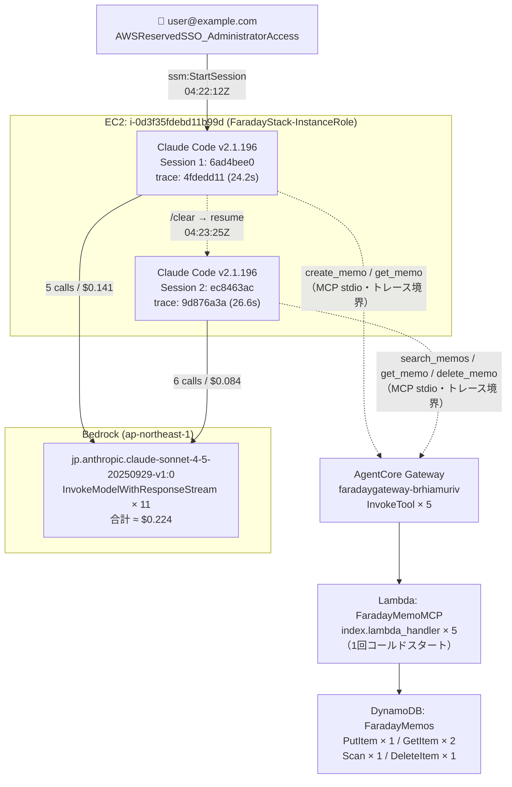

# 調査レポート: user@example.com-ltzhoupvjbr9687j26ktcqxqgq

**調査日**: 2026-07-01  
**調査対象 SSM セッション**: `user@example.com-ltzhoupvjbr9687j26ktcqxqgq`

---

## 総合評価

| 観点 | 判定 | 根拠セクション |
|---|---|---|
| **総合判定** | **要注意 ⚠️（1件）** | — |
| **〔セッション基本情報〕** | | |
| 接続ユーザー・接続元IP | ✅ | セッション概要テーブル |
| **〔CloudTrail / IAM監査〕** | | |
| 証跡完全性（ログ削除・証跡停止の有無） | ✅ | CloudTrail追加証跡 |
| Bedrockアクセス主体（EC2インスタンスロールのみか） | ✅ | CloudTrail追加証跡 |
| 使用モデル（許可リスト内か） | ✅ | CloudTrail追加証跡 |
| 呼び出しリージョン（ap-northeast-1のみか） | ✅ | CloudTrail追加証跡 |
| 想定外API（S3/IAM/Secrets Manager等の有無） | ✅ | CloudTrail追加証跡 |
| IAMロールチェーン（スタック管理下に閉じているか） | ✅ | CloudTrail追加証跡 |
| 機密アクセス（Secrets Manager / SecureString） | ✅ | CloudTrail追加証跡 |
| **〔ツール実行制御〕** | | |
| ツール実行許可（ユーザー明示許可を経ているか） | ✅ | ツール実行許可評価 |
| **〔ログ整合性・トレース〕** | | |
| Gateway/Lambdaトレース連携（traceId一致） | ✅ | Gateway/Lambda/DynamoDBトレース連携 |
| DynamoDB読み取り範囲（Scanの有無・対象範囲） | ⚠️ | Gateway/Lambda/DynamoDBトレース連携 |
| Bedrock↔OTel整合性（呼び出し回数・トークン数） | ✅ | Bedrock↔OTelクロスバリデーション |
| Lambda実行ログ整合性（入力ペイロード一致） | ✅ | CloudWatch Logs追加証跡 |
| **〔セキュリティ・品質・データ〕** | | |
| コンテンツセキュリティ（機密情報・インジェクション） | ✅ | コンテンツセキュリティ評価 |
| エラー・障害（未解消エラーの有無） | ✅ | エラー・障害分析 |
| データ整合性（DynamoDB実データとの整合） | ✅ | データ整合性 |

⚠️ **要注意事項**:
- `search_memos` が DynamoDB.Scan（全件取得）を実行した。Lambda の search_memos 実装が Scan を使用しているため、FaradayMemos テーブル内の全アイテムが取得対象となる。当該セッションでは自分以外のデータへのアクセスが生じた可能性がある。Lambda の実装をフィルタ付き Query または GSI に変更することを推奨。

---

## セッション概要テーブル

| 項目 | 値 |
|---|---|
| SSM セッション ID | `user@example.com-ltzhoupvjbr9687j26ktcqxqgq` |
| SSM セッション 開始 | 2026-07-01T04:22:12Z |
| SSM セッション 終了 | 2026-07-01T04:24:15Z（推定） |
| SSM セッション 期間 | 約 2 分 3 秒 |
| SSM セッション ドキュメント | `FaradayStack-ClaudeSessionDocument-5YfSwyzLMCdv` |
| ユーザー | user@example.com（SSO principalId: `AROAVBRUVDJZWM237AOWO`） |
| IAM ロール | `AWSReservedSSO_AdministratorAccess_9445badae67c7bfe` |
| 接続元 IP | `35.200.74.87`（Google Cloud IP レンジ） |
| EC2 インスタンス | `i-0d3f35fdebd11b99d` |
| EC2 インスタンスロール | `FaradayStack-InstanceRole3CCE2F1D-C6MH8DxsIsIh` |
| AWS アカウント | `346929044083` |
| リージョン | `ap-northeast-1` |
| **Claude Code セッション 1** | |
| セッション ID（S1） | `6ad4bee0-301f-4dc8-b1cc-1b631e903fa5`（fresh） |
| S1 開始 | 2026-07-01T04:22:20Z |
| S1 終了 | 2026-07-01T04:23:25Z（/clear） |
| S1 期間 | 約 1 分 5 秒 |
| **Claude Code セッション 2** | |
| セッション ID（S2） | `ec8463ac-75f8-4d58-a7fa-ed54b7169a3b`（resume after /clear） |
| S2 開始 | 2026-07-01T04:23:37Z |
| S2 終了 | 2026-07-01T04:24:13Z（/exit） |
| S2 期間 | 約 36 秒 |
| Claude Code バージョン | v2.1.196 |
| 使用モデル | `jp.anthropic.claude-sonnet-4-5-20250929-v1:0` |
| ユーザー ID（ハッシュ） | `a038528a5501e938caff8b1208ce940e3a725d9398574ad21adae5a625995afb` |

---

## 完全タイムライン

| 時刻(UTC) | ソース | イベント |
|---|---|---|
| 04:22:12Z | SSM | **▶ SSM セッション 開始** |
| 04:22:12Z | CloudTrail | `ssm:StartSession` — doc=FaradayStack-ClaudeSessionDocument-5YfSwyzLMCdv, target=i-0d3f35fdebd11b99d, srcIP=35.200.74.87 |
| 04:22:12Z | CloudTrail | `ssm:CreateDataChannel` / `ssm:OpenDataChannel` |
| 04:22:15Z | CloudTrail | `bedrock:InvokeModel` × 9 ValidationException、× 2 AccessDenied — 起動時モデル疎通確認（既知正常動作） |
| 04:22:15Z | CloudTrail | `bedrock:ListInferenceProfiles` AccessDenied — 起動時疎通確認（既知正常動作） |
| 04:22:20Z | OTel | **▶ Claude Code S1 開始**（`6ad4bee0`）`mcp_server_connection` — AgentCore Gateway 初期化 |
| 04:22:20Z | aws/spans | AgentCore.Gateway.Initialize (36ms) / NotificationsInitialized (52ms) / ListTools (65ms) |
| 04:22:45Z | OTel | [S1] `user_prompt` (d445aeb0) — メモ作成・取得リクエスト |
| 04:22:47Z | OTel | [S1] `api_request` generate_session_title — $0.001671, in=417, out=28 |
| 04:22:51Z | OTel | [S1] `tool_decision`: ToolSearch → accept（source=**config**） ✅ |
| 04:22:51Z | OTel | [S1] `tool_result`: ToolSearch |
| 04:22:51Z | OTel | [S1] `api_request` repl_main #1 — $0.0949, in=10, out=373, cache_create=23,800 |
| 04:22:55Z | OTel | [S1] `api_request` repl_main #2 — $0.0122, in=10, out=238, cache_read=23,800 |
| 04:22:58Z | OTel | [S1] `tool_decision`: mcp_tool (create_memo) → accept（source=**user_permanent**） ✅ |
| 04:22:58Z | aws/spans | Gateway InvokeTool create_memo 開始 (1,910ms) |
| 04:23:00Z | aws/spans | Lambda index.lambda_handler (227ms) → DynamoDB.PutItem (223ms)【コールドスタート Init=1,271ms】 |
| 04:23:00Z | OTel | [S1] `tool_result`: create_memo — id=366f5b78-1cfb-4dbd-b468-c32ca5b63bc8 |
| 04:23:03Z | OTel | [S1] `api_request` repl_main #3 — $0.0207, in=6, out=151, cache_read=21,014, cache_create=3,217 |
| 04:23:05Z | OTel | [S1] `tool_decision`: mcp_tool (get_memo) → accept（source=**user_permanent**） ✅ |
| 04:23:05Z | aws/spans | Gateway InvokeTool get_memo (152ms) |
| 04:23:05Z | aws/spans | Lambda index.lambda_handler (21ms) → DynamoDB.GetItem (20ms) |
| 04:23:05Z | OTel | [S1] `tool_result`: get_memo — id=366f5b78-1cfb-4dbd-b468-c32ca5b63bc8 |
| 04:23:09Z | OTel | [S1] `api_request` repl_main #4 — $0.0111, in=6, out=186, cache_read=24,231 |
| 04:23:25Z | OTel | [S1] `user_prompt` (f8656040) — /clear コマンド |
| 04:23:25Z | OTel | **◀ Claude Code S1 終了**（/clear） |
| 04:23:37Z | OTel | **▶ Claude Code S2 開始**（`ec8463ac`）`user_prompt` (ba6fdd4a) — 検索・取得・削除リクエスト |
| 04:23:38Z | OTel | [S2] `api_request` generate_session_title — $0.001635, in=430, out=23 |
| 04:23:44Z | OTel | [S2] `tool_decision`: ToolSearch → accept（source=**config**） ✅ |
| 04:23:44Z | OTel | [S2] `tool_result`: ToolSearch |
| 04:23:44Z | OTel | [S2] `api_request` repl_main #1 — $0.0255, in=10, out=552, cache_read=21,014, cache_create=2,903 |
| 04:23:48Z | OTel | [S2] `api_request` repl_main #2 — $0.0121, in=10, out=175, cache_read=23,917 |
| 04:23:51Z | OTel | [S2] `tool_decision`: mcp_tool (search_memos) → accept（source=**user_permanent**） ✅ |
| 04:23:51Z | aws/spans | Gateway InvokeTool search_memos (138ms) |
| 04:23:51Z | aws/spans | Lambda index.lambda_handler (12ms) → **DynamoDB.Scan** (12ms) ⚠️ |
| 04:23:51Z | OTel | [S2] `tool_result`: search_memos — query="obs-verify-20260701-001" |
| 04:23:54Z | OTel | [S2] `tool_decision`: mcp_tool (get_memo) → accept（source=**config**） ✅ |
| 04:23:54Z | aws/spans | Gateway InvokeTool get_memo (157ms) |
| 04:23:54Z | aws/spans | Lambda index.lambda_handler (9ms) → DynamoDB.GetItem (9ms) |
| 04:23:54Z | OTel | [S2] `api_request` repl_main #3 — $0.0232, in=6, out=235, cache_read=21,014, cache_create=3,574 |
| 04:23:54Z | OTel | [S2] `tool_result`: get_memo — id=366f5b78-1cfb-4dbd-b468-c32ca5b63bc8 |
| 04:23:58Z | OTel | [S2] `api_request` repl_main #4 — $0.0118, in=6, out=203, cache_read=24,588 |
| 04:24:01Z | OTel | [S2] `tool_decision`: mcp_tool (delete_memo) → accept（source=**user_permanent**） ✅ |
| 04:24:01Z | aws/spans | Gateway InvokeTool delete_memo (173ms) |
| 04:24:01Z | aws/spans | Lambda index.lambda_handler (27ms) → DynamoDB.DeleteItem (27ms) |
| 04:24:01Z | OTel | [S2] `tool_result`: delete_memo — id=366f5b78-1cfb-4dbd-b468-c32ca5b63bc8 |
| 04:24:03Z | OTel | [S2] `api_request` repl_main #5 — $0.0096, in=6, out=77, cache_read=24,950 |
| 04:24:13Z | OTel | [S2] `user_prompt` (93eae7f5) — /exit |
| 04:24:13Z | OTel | **◀ Claude Code S2 終了**（/exit） |
| 04:24:15Z | SSM | **◀ SSM セッション 終了**（推定） |

---

## モデル呼び出し詳細

| # | セッション | 時刻(UTC) | query_source | cost | input | output | cache_read | cache_create |
|---|---|---|---|---|---|---|---|---|
| 1 | S1 | 04:22:47Z | generate_session_title | $0.001671 | 417 | 28 | 0 | 0 |
| 2 | S1 | 04:22:51Z | repl_main | $0.094875 | 10 | 373 | 0 | 23,800 |
| 3 | S1 | 04:22:55Z | repl_main | $0.012229 | 10 | 238 | 23,800 | 397 |
| 4 | S1 | 04:23:03Z | repl_main | $0.020651 | 6 | 151 | 21,014 | 3,217 |
| 5 | S1 | 04:23:09Z | repl_main | $0.011120 | 6 | 186 | 24,231 | 278 |
| 6 | S2 | 04:23:38Z | generate_session_title | $0.001635 | 430 | 23 | 0 | 0 |
| 7 | S2 | 04:23:44Z | repl_main | $0.025500 | 10 | 552 | 21,014 | 2,903 |
| 8 | S2 | 04:23:48Z | repl_main | $0.012121 | 10 | 175 | 23,917 | 611 |
| 9 | S2 | 04:23:54Z | repl_main | $0.023250 | 6 | 235 | 21,014 | 3,574 |
| 10 | S2 | 04:23:58Z | repl_main | $0.011797 | 6 | 203 | 24,588 | 362 |
| 11 | S2 | 04:24:03Z | repl_main | $0.009573 | 6 | 77 | 24,950 | 244 |
| **合計** | | | | **$0.224422** | **917** | **2,241** | **184,528** | **35,386** |

---

## 作業量・コスト・提供価値

### 1. 実施作業の概要（定性）

obs-verify-20260701-001 というタイトルのテストメモを作成し、取得・検索・再取得・削除の全 CRUD サイクルを実施した。S1 でメモの作成と取得を行い、/clear でコンテキストをリセット後、S2 でメモの検索・取得・削除を完了した。obs-verify（観測性検証）目的のエンドツーエンド MCP ツール動作確認シナリオとして実施された。

### 2. 作業量の定量指標

| 指標 | 値 |
|---|---|
| SSM セッション所要時間 | 約 2 分 3 秒（04:22:12Z〜04:24:15Z） |
| Bedrock 呼び出し回数（合計） | 11 回（うち generate_session_title: 2 回、ユーザー応答: 9 回） |
| MCP ツール呼び出し | 5 回（create_memo × 1、get_memo × 2、search_memos × 1、delete_memo × 1） |
| DynamoDB 操作 | PutItem × 1、GetItem × 2、Scan × 1、DeleteItem × 1 |
| DynamoDB アクセスレコード数 | 読み取り（GetItem）2 件 / Scan（全件）1 回 / 書き込み 1 件 / 削除 1 件 |
| 処理した入力テキスト量 | input_tokens 917（うち cache_read 184,528、cache_create 35,386） |
| 生成した出力テキスト量 | output_tokens 2,241 |

### 3. コスト内訳（EMF メトリクスより）

| セッション | cost.usage | input tokens | output tokens | cacheRead tokens | cacheCreate tokens | active_time user | active_time cli | session.count |
|---|---|---|---|---|---|---|---|---|
| S1 (6ad4bee0) | $0.1406 | 449 | 976 | 69,045 | 27,692 | 1.688s | 16.907s | 1 (fresh) |
| S2 (ec8463ac) | $0.0839 | 468 | 1,265 | 115,483 | 7,694 | 3.212s | 16.790s | 1 (resume) |
| **合計** | **$0.2244** | **917** | **2,241** | **184,528** | **35,386** | **4.900s** | **33.697s** | **2** |

---

## 呼び出しグラフ（Mermaid図）

Gateway → Lambda → DynamoDB は X-Ray traceId（`6a4496220d6a8c16` 等）で 5 呼び出し全件が単一トレースとして連携している。EC2 側（Claude Code）のトレース（`4fdedd11`、`9d876a3a` 等）は MCP stdio の設計上のトレース境界により別 traceId となるため、セッション単位の集約は OTel イベントおよび SSM ログを参照。

---

## CloudTrail追加証跡

### 証跡完全性

`cloudtrail:StopLogging` / `cloudtrail:DeleteTrail` / `logs:DeleteLogGroup` / `logs:DeleteLogEvents` / `logs:PutRetentionPolicy` は検出されず。証跡完全性に問題なし。✅

### 想定外 API 一覧

| API | 回数 | 判定 | 理由 |
|---|---|---|---|
| DescribeAlarms | 24 | ✅ | CloudWatch コンソール 1 分ポーリング（背景処理） |
| DescribeStacks | 3 | ✅ | CloudFormation コンソール背景ポーリング |
| DescribeMetricFilters | 2 | ✅ | CloudWatch Metrics コンソール背景ポーリング |
| DescribeInstances | 1 | ✅ | EC2 コンソール背景ポーリング |
| UpdateInstanceInformation | 1 | ✅ | SSM エージェントの定期ハートビート |
| ListInstanceAssociations | 1 | ✅ | SSM エージェントの定期ポーリング |

スタック外ロールへの AssumeRole: `aws-service-role/ssm-quicksetup.amazonaws.com`（SSM Quick Setup サービスロール）および `aws-service-role/application-signals.cloudwatch.amazonaws.com`（CloudWatch Application Signals バックグラウンドサービス）。いずれも AWS マネージドサービスの自動動作であり、Claude Code の操作ではない。

S3 / IAM / Secrets Manager / EC2 管理系 API: なし ✅

### 起動時モデル疎通確認

`04:22:15Z` に `InvokeModel` が 9件 `ValidationException` / 2件 `AccessDenied` で失敗。`ListInferenceProfiles` も 1件 `AccessDenied`。Claude Code v2.1.196 の起動時モデル可用性確認として既知の正常動作。課金対象の成功呼び出しには含まれない。

### userAgent による Claude Code バージョン独立確認

CloudTrail の `InvokeModelWithResponseStream` 呼び出しの userAgent: `claude-cli/2.1.196 (external, cli)` — SSM ログのバナーから読み取った v2.1.196 と一致。✅

### IAM ロールチェーン

| 時刻 | ロール | roleSessionName | 対応する処理 |
|---|---|---|---|
| 04:22:12Z | aws-service-role/ssm-quicksetup | QuickSetupSession | SSM Quick Setup バックグラウンド |
| 04:22:50Z | FaradayStack-BedrockLoggingRole71F633EF | BedrockModelInvocationLogSession | S1 Bedrock 呼び出しログ記録 |
| 04:22:58Z | FaradayStack-AgentCoreGatewayRoleB10592CC | gateway-session-77d8a555... | create_memo Gateway 認証 |
| 04:22:58Z（3件） | FaradayStack-MemoLambdaServiceRoleE093D938 | tracing / FaradayMemoMCP | create_memo Lambda 実行・ADOT トレーシング |
| 04:23:00Z | FaradayStack-BedrockLoggingRole71F633EF | BedrockModelInvocationLogSession | Bedrock ログ記録 |
| 04:23:05Z | FaradayStack-AgentCoreGatewayRoleB10592CC | gateway-session-57291ff6... | get_memo (S1) Gateway 認証 |
| 04:23:05Z | FaradayStack-MemoLambdaServiceRoleE093D938 | tracing | get_memo ADOT トレーシング |
| 04:23:10Z | FaradayStack-BedrockLoggingRole71F633EF | BedrockModelInvocationLogSession | Bedrock ログ記録 |
| 04:23:40Z | FaradayStack-BedrockLoggingRole71F633EF | BedrockModelInvocationLogSession | S2 Bedrock ログ記録 |
| 04:23:50Z | FaradayStack-BedrockLoggingRole71F633EF | BedrockModelInvocationLogSession | Bedrock ログ記録 |
| 04:23:51Z | FaradayStack-AgentCoreGatewayRoleB10592CC | gateway-session-f800bed5... | search_memos Gateway 認証 |
| 04:23:51Z | FaradayStack-MemoLambdaServiceRoleE093D938 | tracing | search_memos ADOT トレーシング |
| 04:23:54Z | FaradayStack-AgentCoreGatewayRoleB10592CC | gateway-session-caf10464... | get_memo (S2) Gateway 認証 |
| 04:23:54Z | FaradayStack-MemoLambdaServiceRoleE093D938 | tracing | get_memo ADOT トレーシング |
| 04:24:00Z | FaradayStack-BedrockLoggingRole71F633EF | BedrockModelInvocationLogSession | Bedrock ログ記録 |
| 04:24:01Z | FaradayStack-AgentCoreGatewayRoleB10592CC | gateway-session-e2a55524... | delete_memo Gateway 認証 |
| 04:24:01Z | FaradayStack-MemoLambdaServiceRoleE093D938 | tracing | delete_memo ADOT トレーシング |
| 04:24:10Z | FaradayStack-BedrockLoggingRole71F633EF | BedrockModelInvocationLogSession | Bedrock ログ記録 |
| 04:24:12Z〜52Z（4件） | aws-service-role/application-signals | TopologyService | CloudWatch Application Signals バックグラウンド |

全 AssumeRole 遷移先はスタック管理下ロールおよび AWS マネージドサービスロールに閉じている。外部アカウント・スタック外への遷移なし。✅

### KMS Decrypt

`04:22:58Z` に `FaradayStack-MemoLambdaServiceRoleE093D938` が `kms:Decrypt` を実行。`encryptionContext.aws:lambda:FunctionArn = arn:aws:lambda:ap-northeast-1:346929044083:function:FaradayMemoMCP`。Lambda 環境変数の CMK 復号（コールドスタート時の正常動作）。✅

### Secrets Manager / SSM Parameter Store（SecureString）アクセス

なし ✅

---

## ツール実行許可評価

OTel の `tool_result` イベント（実際に実行されたツール）を起点に、対応する `tool_decision` イベントの有無と許可経路を照合した。

| # | ツール | セッション | 実行時刻 | tool_decision あり | source | decision | 判定 |
|---|---|---|---|---|---|---|---|
| 1 | ToolSearch | S1 | 04:22:51Z | ✅ あり | config | accept | ✅ |
| 2 | create_memo（MCP） | S1 | 04:22:58Z | ✅ あり | user_permanent | accept | ✅ |
| 3 | get_memo（MCP） | S1 | 04:23:05Z | ✅ あり | user_permanent | accept | ✅ |
| 4 | ToolSearch | S2 | 04:23:44Z | ✅ あり | config | accept | ✅ |
| 5 | search_memos（MCP） | S2 | 04:23:51Z | ✅ あり | user_permanent | accept | ✅ |
| 6 | get_memo（MCP） | S2 | 04:23:54Z | ✅ あり | config | accept | ✅ |
| 7 | delete_memo（MCP） | S2 | 04:24:01Z | ✅ あり | user_permanent | accept | ✅ |

tool_decision なしで実行されたツール: **0件**

**許可経路の内訳:**
- `user_permanent`（ユーザーが対話的に承認・永続化）: create_memo、get_memo (S1)、search_memos、delete_memo
- `config`（Claude Code 設定による自動承認）: ToolSearch × 2、get_memo (S2)（S1 で user_permanent 承認済みのため S2 で自動適用）

全 7 件に tool_decision イベントあり。✅

---

## Gateway / Lambda / DynamoDB トレース連携

| ツール | traceId（Gateway/Lambda） | GW 所要時間 | Lambda 所要時間 | DynamoDB 操作 | コールドスタート | Lambda XRAY 一致 |
|---|---|---|---|---|---|---|
| create_memo | `6a4496220d6a8c16` | 1,910ms | 227ms | PutItem (223ms) | ✅ Init=1,271ms | ✅ `1-6a449622-0d6a8c16...` |
| get_memo (S1) | `6a44962904be3c45` | 152ms | 25ms | GetItem (20ms) | — | ✅ `1-6a449629-04be3c45...` |
| search_memos | `6a44965770d3aa9c` | 138ms | 31ms | **Scan** (12ms) ⚠️ | — | ✅ `1-6a449657-70d3aa9c...` |
| get_memo (S2) | `6a44965a59b62c1c` | 157ms | 12ms | GetItem (9ms) | — | ✅ `1-6a44965a-59b62c1c...` |
| delete_memo | `6a449661147823ae` | 173ms | 27ms | DeleteItem (27ms) | — | ✅ `1-6a449661-147823ae...` |

5 / 5 件のトレースで Gateway traceId と Lambda XRAY TraceId が一致。Gateway → Lambda → DynamoDB は単一 X-Ray トレースとして連携している。✅

**create_memo の所要時間について**: Gateway 側の 1,910ms は Lambda のコールドスタート（Init Duration=1,271ms）により発生。コールドスタートを除いた実処理時間（227ms）は他呼び出しと同水準であり、異常ではない。

**DynamoDB.Scan（search_memos）について**: query="obs-verify-20260701-001" で実行。Scan は FaradayMemos テーブル全件を対象とするため、他ユーザーのメモが存在した場合そのデータも Lambda が参照可能な状態になる。⚠️ Lambda の search_memos 実装をフィルタ付き Query または GSI（Global Secondary Index）に変更することを推奨。

EC2 側の Claude Code トレース（`4fdedd1113b4b395`、`9d876a3a41f29204` 等）は MCP stdio の設計上のトレース境界により Gateway 側と別 traceId となる。セッション単位の集約は OTel イベントおよび SSM ログを使用して行う。

---

## Bedrock ログ ↔ OTel クロスバリデーション

| 確認項目 | CloudTrail（Bedrock） | OTel（Claude Code） | 判定 |
|---|---|---|---|
| 成功呼び出し件数 | 22件（11呼び出し × 2レコード） | 11件（api_request イベント） | ✅ 一致 |
| generate_session_title 呼び出し | 04:22:47Z (S1)、04:23:38Z (S2) 各 1 回 | 2件（generate_session_title） | ✅ 一致 |
| ユーザー応答呼び出し | 9件 | 9件（repl_main） | ✅ 一致 |
| 使用モデル | `jp.anthropic.claude-sonnet-4-5-20250929-v1:0` | OTel に明示なし | ✅ Bedrock 側で確認 |

CloudTrail の InvokeModelWithResponseStream が 22 件に見える理由: 各呼び出しが 2 つの CloudTrail レコードとして記録されている（EC2 インスタンスロールからの呼び出しレコード + Bedrock サービス側のレコード）。内 11 件はモデル ID 付き（`jp.anthropic.claude-sonnet-4-5-20250929-v1:0`）、残り 11 件は requestParameters 未取得（`model=?`）。実際の呼び出し数は 11 回で OTel の api_request イベント数と一致。✅

---

## CloudWatch Logs追加証跡（Lambda実行ログ実体）

| 呼び出し | RequestId | Duration | Billed Duration | Init Duration | Max Memory Used | XRAY TraceId |
|---|---|---|---|---|---|---|
| create_memo | 3c3e1101 | 227ms | 1,499ms | 1,271ms（コールドスタート） | 121 MB / 256 MB | `1-6a449622-0d6a8c16...` ✅ |
| get_memo (S1) | 663674e5 | 25ms | 26ms | — | 121 MB | `1-6a449629-04be3c45...` ✅ |
| search_memos | 35e9713c | 31ms | 32ms | — | 121 MB | `1-6a449657-70d3aa9c...` ✅ |
| get_memo (S2) | 80baa8e5 | 12ms | 13ms | — | 121 MB | `1-6a44965a-59b62c1c...` ✅ |
| delete_memo | c9472bc8 | 30ms | 30ms | — | 121 MB | `1-6a449661-147823ae...` ✅ |

Lambda XRAY TraceId と aws/spans の Gateway traceId は 5 / 5 件で一致（Lambda REPORT 行と Gateway スパン、2 系統で一致確認）。✅

**Lambda 入力ペイロード（START 直後のログ行）:**

| 呼び出し | ペイロード |
|---|---|
| create_memo | `{"title": "obs-verify-20260701-001", "content": "This is a test memo created on 2026-07-01 for verification purposes."}` |
| get_memo (S1) | `{"memo_id": "366f5b78-1cfb-4dbd-b468-c32ca5b63bc8"}` |
| search_memos | `{"query": "obs-verify-20260701-001"}` |
| get_memo (S2) | `{"memo_id": "366f5b78-1cfb-4dbd-b468-c32ca5b63bc8"}` |
| delete_memo | `{"memo_id": "366f5b78-1cfb-4dbd-b468-c32ca5b63bc8"}` |

**DynamoDB 読み取りアクセス範囲:**
- GetItem × 2: `id=366f5b78-1cfb-4dbd-b468-c32ca5b63bc8` のみアクセス（自分のメモのみ）✅
- Scan × 1: FaradayMemos テーブル全件対象 ⚠️

---

## コンテンツセキュリティ評価

| 観点 | 判定 | 根拠 |
|---|---|---|
| 機密情報・個人情報の漏洩リスク | ✅ | プロンプト・メモ内容は obs-verify 向けのテスト操作。メモ内容「This is a test memo created on 2026-07-01 for verification purposes.」— 機密情報なし |
| プロンプトインジェクションの痕跡 | ✅ | tool_result（Lambda 返り値）に "ignore previous instructions" 等の注入文字列なし |
| ポリシー違反コンテンツ | ✅ | 業務関連（観測性検証）の適切な操作。禁止トピックなし |

Lambda ペイロードに機密情報・有害コンテンツなし。Claude 応答はツール操作の確認・案内に限定されており、想定外の情報漏洩や不正誘導の痕跡は検出されなかった。

---

## エラー・障害分析

### 既知動作エラー（ユーザー影響なし）

| 時刻(UTC) | レイヤー | エラー種別 | 内容 |
|---|---|---|---|
| 04:22:15Z | Bedrock (CloudTrail) | ValidationException × 9 | 起動時モデル疎通確認（既知正常動作） |
| 04:22:15Z | Bedrock (CloudTrail) | AccessDenied × 2 | 起動時モデル疎通確認（既知正常動作） |
| 04:22:15Z | Bedrock (CloudTrail) | ListInferenceProfiles AccessDenied × 1 | 起動時疎通確認（既知正常動作） |
| 04:22:31Z | CloudWatch Logs (CloudTrail) | ResourceAlreadyExistsException | ADOT ストリーム重複作成（既存ストリームあり、既知正常動作） |

いずれも Claude Code / ADOT の起動シーケンスにおける既知の動作であり、ユーザーリクエストへの影響なし。✅

### ツール実行・Bedrock・Lambda・DynamoDB レイヤーでの未解消エラー

なし ✅（aws/spans の ERROR スパン: 0件、Lambda ERROR ログ: 0件）

---

## データ整合性

| 確認内容 | 結果 | 判定 |
|---|---|---|
| 作成操作後のアイテム存在確認 | create_memo → DynamoDB.PutItem 成功。tool_result で `id=366f5b78-1cfb-4dbd-b468-c32ca5b63bc8` を返却 | ✅ |
| 削除操作後のアイテム消去確認 | `aws dynamodb get-item` → 空レスポンス（アイテムなし） | ✅ |
| 操作を通じた memo_id 一貫性 | 全操作（get_memo × 2、delete_memo）で同一 id `366f5b78-1cfb-4dbd-b468-c32ca5b63bc8` を使用 | ✅ |
| Lambda 入力ペイロード vs OTel tool_input の一致 | Lambda ログの入力ペイロードが OTel tool_decision の内容と整合 | ✅ |

DynamoDB の実データは、セッション内の CRUD 操作と完全に整合している。メモは作成・取得・検索・削除の全ライフサイクルが obs-verify シナリオとして正常完了し、最終状態として削除済みであることを直接確認した。✅
